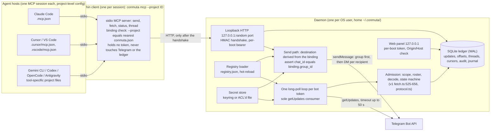
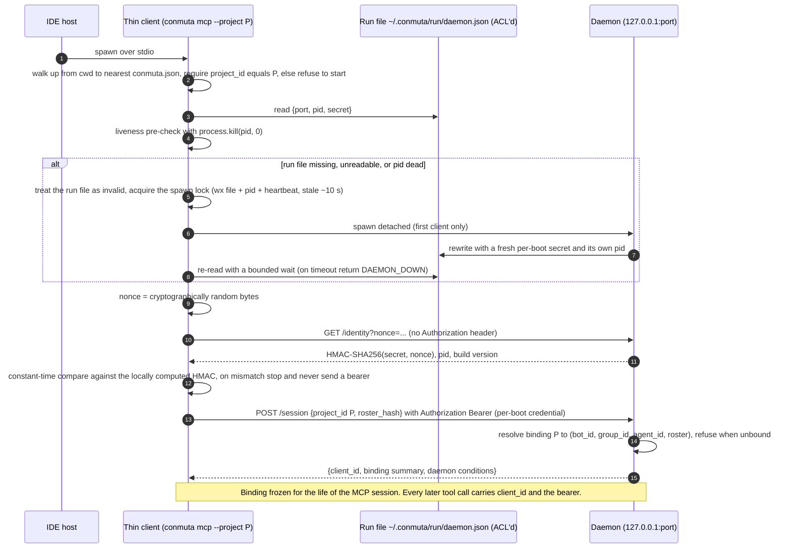

# Conmuta v2 — Architecture overview

> **Working name.** "Conmuta" is a working name pending trademark clearance (backlog [B-11](../06-backlog/CHECKLIST.md); fallback "Emisario"). Every identifier that embeds the name — `conmuta.json`, `conmuta mcp`, `~/.conmuta/`, `@conmuta/*` — follows the final name.

**Status:** F0 landing. The architecture below was landed by Arena debate `bus-v2-landing-architecture-001` (CONSENSUS after 2 rounds; record in [../05-tribunal/INDEX.md](../05-tribunal/INDEX.md)). No code exists yet. Schemas are drafted in [DATA-MODEL.md](DATA-MODEL.md), threats in [THREAT-MODEL.md](THREAT-MODEL.md), the binding law in [../01-constitution/CONSTITUTION.md](../01-constitution/CONSTITUTION.md), the phases in [../07-plan/WORK-PLAN.md](../07-plan/WORK-PLAN.md).

**How to read citations.** `v1 <path>:<lines>` refers to the v1 repository `telegram-agent-bus` at `v1.0.2-2-gbf8f365`. `bundle: maps[key]` / `bundle: research[key]` refers to the F0 analysis bundle. `D1`–`D11`, `H1`–`H7`, `A1`–`A4`, `n1`–`n4` refer to decisions, verified facts, amendments and objections in the tribunal record. Anything not yet decided is marked **pending Director decision** with its backlog id.

## 1. The system in one paragraph

Conmuta is "the project switchboard for human-owned coding agents". Each human developer owns one Telegram bot **per project**; each project has exactly one Telegram supergroup; the team's agents talk over that group (the human-readable plane) and over bot-to-bot direct messages (the agent plane) using the `AGENTBUS/2` wire inherited unchanged from v1 (D1). v2 replaces v1's one-process-per-IDE-session model with **one daemon per OS user** — the sole Telegram poller, holding every token and a durable inbox — and **thin per-project stdio MCP clients** that each IDE spawns (D3). Isolation is enforced by construction, not by convention: a bijective binding bot ↔ group ↔ project (D2), an id-only committed project file (D5), and a client that refuses to start when it is not bound (D5). The core is a passive switch: it never executes, never emits on its own, and treats everything it receives as data (D6; Invariant 5).

## 2. Decisions this document implements

| Decision | One line | Where it is recorded |
|---|---|---|
| D1 | New repository; v1 pure modules reused as a library; wire unchanged (emit `AGENTBUS/2`, accept `/1` and `/2`); any future wire change only by ADR with a per-binding coordinated send freeze | Constitution (freeze doctrine) |
| D2 | One bot per (human, project); bijective binding bot ↔ group ↔ project; a `bot_id` appears in at most one active binding | [ADR-0028](../03-adr/0028-project-scoped-bijective-binding.md) |
| D3 | One daemon per OS user = sole `getUpdates` consumer per token; thin stdio clients; loopback HTTP IPC with a challenge-response handshake | [ADR-0029](../03-adr/0029-per-user-daemon-and-thin-clients.md) |
| D4 | Human-editable JSON registry + `node:sqlite` ledger (WAL); OS keychain for tokens; no Docker in the client product | [ADR-0030](../03-adr/0030-sqlite-ledger-and-json-registry.md) |
| D5 | Committed id-only `conmuta.json`; id-only stdio entries merged into each detected tool's project config; launcher requires `--project` and refuses when unbound or mismatched | ADR-0028, §6 below |
| D6 | The core (daemon + thin client) is a passive switch under v1 ADR-06 layers 1–2; the headless runner is a satellite; the Claude Code channels adapter is an optional doorbell | Constitution, §7.6 and §13 below |
| D7 | Arena-light 2-party debates as body-marker subtypes over the existing thread model; daemon-enforced round cap; side journal in SQLite | §11 below; F5 spec |
| D9 | Node ≥ 24, TypeScript ESM, `node:test` with strict TDD, MCP SDK + zod, `@clack/prompts`, daemon-served web panel, npm publish with compiled `dist`, never `npx` | [ADR-0031](../03-adr/0031-npm-distribution-and-license.md), §12 below |

## 3. Why v1 could not do this (evidence)

Every v2 structure below answers a verified v1 limitation. Nothing here is a preference.

| v1 fact (evidence) | Consequence in v1 | v2 answer |
|---|---|---|
| One stdio process per IDE session binds ONE home, config, token, `chat_id`, roster, state and lock at startup (v1 `src/index.ts:250-269`, `src/config.ts:173-184`) | Single-tenant by construction; N projects need N homes and N env-injected tokens (bundle: maps[transport]) | Registry of bindings served by one daemon (D2, D3) |
| Cursor advance and presentation are the same operation under one lock (v1 `src/tools/fetch.ts:500-930`; `first_surfaced_at`/`last_surfaced_digest` are global in `state.json`, `src/state.ts:67,123`) | Two IDE clients on one project collide: `BRIDGE_BUSY` during a 50 s long-poll and `body_omitted` for work the second client never saw (v1 `src/tools/fetch.ts:807-812, 826-854`) | Daemon consumes; clients read through per-client cursors and per-client surfaced-state (§7.4) |
| One bot token = exactly one `getUpdates` consumer; HTTP 409 mapped to `TELEGRAM_CONFLICT`, non-retryable (H1; v1 `src/telegram.ts:106-118, 250-254`) | A second poller on the same token is a configuration fault and, worse, two divergent cursors confirm updates the other never saw | Daemon is the sole consumer; a second daemon instance refuses to poll (Invariant 3) |
| Unfetched updates are dropped after 24 h and there is no history read (H2; v1 `src/config.ts:59-72`) | Loss whenever no session fetched for a day; only detected (`gap_warning`, v1 `src/tools/fetch.ts:788-794`), never mitigated | The daemon long-polls continuously while alive (D6); the daemon-down case must stay visible (F1 item, bundle: maps[transport] must_change) |
| The envelope carries no project/group field (v1 `src/envelope.ts:33-60`); the DM plane carries no project context (v1 `src/transport/direct.ts:42-66`) | A bot shared across groups cannot be isolated on the receive side without a wire change | One bot per (human, project); wire unchanged (D2) |
| Any chat other than the configured group is classified `direct` and ingested when the sender is rostered (v1 `src/tools/fetch.ts:436-438, 566`) | Cross-group leakage if a bot is ever in two groups | Scope check on ingest: `foreign_chat` is counted and dropped (Invariant 4) |
| Token in the IDE's env or in `config.json`; no file-mode or platform handling anywhere in `src/` (bundle: maps[config-state]) | Token exposure to every child process and to the editor's default file mode | Secret store in the daemon; tokens never traverse env into IDE processes (D4; Invariant 2) |
| `npx` clone + `tsc` per start took 18 s and exceeded the 30 s MCP timeout in production (v1 `docs/UPGRADE-v1.0.1.md:161-178`) | Sessions failed to attach | npm publish with compiled `dist`, shrinkwrap, files whitelist; never `npx` (D9) |
| Config read once at process start (v1 `src/index.ts:251-252`) | Every roster change required restarting every IDE session | Registry hot-reload in the daemon (D4) |
| Doorbell = one polling process per Claude Code session, ~240 `getUpdates`/h each, "arm exactly one session" rule (bundle: maps[transport]) | Cost and blindness past a 100-update window | The daemon already sees every update; the channels adapter becomes a daemon-fed push (F4, optional) |

## 4. Components



| Component | Responsibility | Never does | Phase | v1 seam reused (evidence) |
|---|---|---|---|---|
| **Agent host** (Claude Code, Cursor, VS Code, Gemini CLI, Codex, OpenCode, Antigravity, …) | Spawns `conmuta mcp --project <id>` over stdio from its project-level MCP config; runs the agent that calls the tools | Holds a token; polls Telegram | F2 (installer writes the entry) | — |
| **Thin client** (`conmuta mcp`) | Exposes the four-tool MCP surface; resolves and freezes the binding; talks to the daemon over IPC; returns `DAEMON_DOWN` when no daemon answers | Polls Telegram; reads the ledger; holds a token; spawns anything but the daemon (lazy spawn, §7.1) | F1 | `createServer(deps)` with injected `client`/`transport`/`homeDir` (v1 `src/index.ts:112-118`) — the deps become IPC stubs (bundle: maps[transport] reusable_as_is); structured `isError` payloads with a closed retryable allowlist (v1 `src/index.ts:45-63`) |
| **Daemon** (`conmuta daemon`, one per OS user) | Loads the registry; resolves tokens; runs one long-poll loop per bot token; admits updates; persists the ledger; serves sends with the binding assertion; serves clients through cursors; hosts the panel; enforces Arena-light caps | Executes anything; emits on a timer; reads files outside its home; rewrites a binding from bus data | F1 (core), F3 (panel), F5 (Arena-light) | `TelegramClient` interface + typed error taxonomy (v1 `src/telegram.ts:73-80`); `Transport` port and the group/direct/dual transports (v1 `src/transport/types.ts:84-86`, `dual.ts:30-61`); classification pipeline (v1 `src/tools/fetch.ts:525-656`); `applyEnvelope` state machine (v1 `src/protocol.ts:186-333`); `state.ts` validation, quarantine and migration (v1 `src/state.ts:333-439`); doctor checks (v1 `src/doctor.ts:100-143`) |
| **Ledger** (`node:sqlite`, WAL) | Durable inbox, per-token offsets, threads, `needs_action`, per-client cursors, per-binding audit log, debate journal | Stores tokens or rejected bodies | F1 | Retention policy and schema-version/quarantine semantics (v1 `src/state.ts:217-250, 375-379`) |
| **Registry** (`~/.conmuta/registry.json`) | Human-editable source of bots, groups, projects, bindings on this machine; hot-reloaded | Contains a token | F1 | `loadConfig` pattern: read → parse → zod → typed error with path (v1 `src/config.ts:209-233`) |
| **Secret store** | Bot tokens keyed by `bot_id` (`@napi-rs/keyring`; fallback ACL'd file) | Exposes a token to any process but the daemon | F1 (verification B-15) | — (v1 had none: bundle: research[security-isolation] T09) |
| **Web panel** | Overview table, validator, registry editing, served by the daemon on `127.0.0.1` with a random port, per-boot token and Origin/Host validation | Runs without the daemon; carries a token | F3 | — |
| **CLI / installer** (`conmuta setup`, `doctor`, wizards) | Node gate, IDE detection, per-project binding, config merge, doctor | Registers the bus globally in OpenCode; writes `enableAllProjectMcpServers: true` | F2 | Doctor checks (v1 `src/doctor.ts:100-143`) re-scoped per binding and split into offline/online tiers (bundle: maps[config-state] must_change) |
| **Telegram Bot API** | External carrier: `getUpdates`, `sendMessage`, `getMe`, `getChat`, plus `getChatMember` (read-only, doctor only) | — | — | v1's four methods (v1 `src/telegram.ts:73-80`) plus `getChatMember`, absent from v1 and recommended by bundle: research[security-isolation] (doctor verifies that every roster bot is a member of `binding.group_id` and is not an admin; [THREAT-MODEL.md](THREAT-MODEL.md) T07, T21, PT-32) |

Satellites that are **outside the core** are listed in §13.

## 5. Planes and wire

| Plane | Carrier | Purpose | v2 change |
|---|---|---|---|
| **Human plane** | Group post: bold header, blank, one-line body, blank, `AGENTBUS/2 {json}` (v1 `src/envelope.ts:200-202`), HTML `parse_mode`, replies anchored to the thread's opening post | Observability for humans; the group is the shared ledger humans can read | Unchanged. Build/wire version rides the render-only header of posts the agent sends anyway — **no heartbeat timer** (amendment A1, B-14) |
| **Agent plane** | Bot-to-bot DM per recipient with byte-identical text (v1 `src/transport/direct.ts:42-66`); requires Bot-to-Bot Communication Mode on both bots (H7) | Authoritative delivery to each addressee | Unchanged. One `DualWriteTransport` per binding, constructed with that binding's `group_id` and roster |
| **Control plane** (new) | Loopback HTTP between thin client and daemon (§9); the web panel; the CLI | Session binding, tool calls, operations | New in v2; never carries a token into a project file or an IDE process |

**Dual write** stays as in v1: group post first (soft failure, except message-level 400s which are hard), then sequential DM per recipient (soft per recipient); the call rejects only when nothing landed; `degraded` is reported when either plane failed (v1 `src/transport/dual.ts:30-61`).

**Wire policy (D1).** Emit `AGENTBUS/2`; accept `/1` and `/2` (v1 `src/config.ts:26, 40`). No wire change in v2. The sentinel versions the wire, never the tenant: isolation comes from bot identity + roster + chat, not from the sentinel (bundle: maps[protocol-tools]). Unknown envelope fields are stripped by the decoder (v1 `src/envelope.ts:115`), so any Arena-light metadata lives in body markers and in the daemon's journal, never in new JSON fields.

**Telegram constraints the daemon must honour (H3–H5).** About 1 message/s per chat and 20 messages/min per group; long-poll clamp 50 s; 4096 characters per message; the effective body ceiling stays ~1,921 plain-ASCII characters because the body travels twice (v1 ADR-23; bundle: maps[protocol-tools]).

## 6. Binding model: `conmuta.json` versus the machine registry

The **bijective binding** is the root decision (D2): one bot token ↔ one group ↔ one project folder. A bot is a member of exactly one group and is never reused across bindings. Alpha's verdict: "the only mathematically watertight architecture without touching the wire". Cost: N × M BotFather bots, guided by the installer.

| | `conmuta.json` (project file) | `~/.conmuta/registry.json` (machine file) |
|---|---|---|
| Location | Repository root, **committed** | The daemon's home, never committed |
| Written by | `conmuta project bind` (first time), then the team through normal version control | `conmuta bot add`, `group add`, `project bind`, the panel, or a careful human editor |
| Read by | The thin client (cross-check at start), the installer, the doctor, the pre-commit validator | The daemon (hot-reload), the CLI, the panel |
| Contains | `schema_version`, `project_id`, `group_id` (numeric supergroup id), `roster [{agent_id, user_id, username}]`, optional `referee` | `bots` (with token *references*), `groups`, `projects`, `bindings` (project → my bot + my `agent_id`) |
| Must never contain | Local paths, tokens, `Authorization` literals, unknown keys (strict zod; token-shape validator in pre-commit and doctor) | Tokens (only `token_ref`) |
| Source of truth for | Who is on this project's bus (team-shared identifiers) | Which of my bots serves which of my project folders |
| Schema | [DATA-MODEL.md §1](DATA-MODEL.md#1-conmutajson-committed-project-file) | [DATA-MODEL.md §2](DATA-MODEL.md#2-conmutaregistryjson-machine-registry) |

**Registry invariant (D2):** one `bot_id` in at most one active binding; by bijectivity, likewise one `group_id` and one `project_id`.

**Launcher resolution (D5).** The thin client:

1. Requires `--project <id>`; it never infers the binding from cwd alone (cwd inheritance is the leakage vector named in bundle: research[security-isolation] T01).
2. Walks up from its cwd to the nearest `conmuta.json`, parses it strictly, and requires `project_id` to equal `--project`. Unbound or mismatched → refuses to start.
3. Opens a session with the daemon (§9); the daemon resolves `project_id → (bot_id, group_id, agent_id, roster)` from the registry and refuses when the project has no active binding.
4. Freezes the binding for the life of the MCP session. `send` carries no destination; the daemon derives (bot, group, roster) from the frozen binding and asserts `chat_id === binding.group_id` before every `sendMessage` (Invariant 1). A two-binding "wrong room" test runs in CI ([THREAT-MODEL.md](THREAT-MODEL.md)).

**Global-only tools** (Windsurf, Cline, JetBrains AI Assistant) have no project-level MCP file (bundle: research[mcp-config-surfaces]); support is best-effort and documented, and it depends on the tool spawning the server with the workspace as cwd (open question in that research). The bus is **never registered globally in OpenCode**: its config merge overlays every project (bundle: research[mcp-config-surfaces], OpenCode finding).

**Bootstrapping `user_id`.** A new member's numeric bot id is unknown until that bot speaks. The daemon keeps a **pending unknown senders** list (`user_id`, `username`, no body) so the `Add group` screen can offer them (D5); until rostered, their messages are counted as `unknown_sender` and dropped (Invariant 4).

## 7. The daemon

### 7.1 Lifecycle (D3)

| Aspect | Behaviour | Evidence / constant |
|---|---|---|
| Instance | One per OS user; a second instance detects the singleton lock and **refuses to poll** | Invariant 3; v1 `wx` lock + pid liveness + owner-checked release reused for election (v1 `src/state.ts:541-577`) |
| Start | Lazy spawn by the first thin client that finds no daemon: acquire a spawn lock (`wx` file + pid + heartbeat, stale after ~10 s), spawn detached, wait bounded; on timeout the client returns `DAEMON_DOWN` and **never polls Telegram itself** | D3; bundle: research[packaging-runtime] (agentinbox #235 incident: spawn without a lock duplicates daemons) |
| Start at login | Optional, without admin: `HKCU\...\Run` value on Windows, `~/Library/LaunchAgents` plist on macOS; no services, no Task Scheduler, no pm2 | D3; bundle: research[packaging-runtime] |
| Stop | Idle auto-shutdown, **disabled while any binding has open threads**; the daemon deletes only files it created | D3 |
| Identity file | `~/.conmuta/run/daemon.json` = `{port, pid, secret}`, ACL'd to the user, rewritten with a fresh secret on every start, invalid when the pid is dead | D3 (objection n2) |
| Windows caveat | `windowsHide` with `detached: true` may flash a console (nodejs/node#21825); verify on Windows 11 in F1 | bundle: research[packaging-runtime] |

All timing values are named constants with their reasoning (constitution: named-constant rule); the exact numbers are fixed in the F1 spec.

### 7.2 Receive path — one loop per bot token

```text
for each active binding (one bot token each):
  loop while daemon alive:
    updates = getUpdates(offset = offsets[bot_id].next_update_id, limit <= 100, timeout <= 50 s)
    BEGIN transaction
      for each update:
        1. no message.text                      -> count non_envelope, audit (no body)
        2. decode sentinel AGENTBUS/1 | /2      -> else count malformed | unsupported_version
        3. scope: chat.id === binding.group_id OR chat.type === "private"
                                                -> else count foreign_chat, audit, DROP
        4. sender: message.from.id in binding.roster
                                                -> else count unknown_sender, record in pending list, DROP
        5. sender === binding.agent_id          -> self-filter, dropped uncounted
        6. eid dedup, anchor translation, applyEnvelope (thread state machine)
        7. append to updates (inbox) + threads + audit
      offsets[bot_id].next_update_id = max(update_id) + 1
    COMMIT   -- only now does the next getUpdates carry the new offset (confirmation)
```

Steps 1, 2, 4, 5, 6 are v1's classification pipeline reused as the admission stage (v1 `src/tools/fetch.ts:525-656`; sender verification by numeric `from.id` at `:538-542`; `applyEnvelope` in `src/protocol.ts:186-333`). Step 3 is new and closes the "second group classified as direct" hole (v1 `src/tools/fetch.ts:436-438`). Writing the inbox **before** advancing the offset is what makes the inbox durable (Invariant 3): Telegram confirms an update only when a later call passes a higher offset (H1; v1 `channel/peek.ts:94-95`). Rejected updates are counted in the audit log without bodies (Invariant 5).

Each loop owns its long-poll timeout (v1 forwarded the caller's `timeout_s` unclamped, `src/tools/fetch.ts:513`; bundle: maps[transport] risk). Telegram `429` (`retry_after_s`) and `409` are surfaced per bot in `status` and the audit log; nothing retries blindly. A daemon outage longer than 24 h still loses updates for every binding on the machine — this is the accepted trade-off versus v1's per-session model and must stay visible (`gap_warning` re-scoped to "daemon was not polling", bundle: maps[transport] must_change).

### 7.3 Send path

| Stage | What happens | Evidence |
|---|---|---|
| Input | `{type, body, to?, thread?, basis?, approval_ref?}` from the client; `from` is never an input, it is stamped from the binding's `agent_id`; `to_user_id` is stamped from the binding's roster | v1 `src/tools/send.ts:47-111, 546-561` |
| Validation pipeline (per binding) | schema → loop prevention (thread known, participant, addressee, not resolved, `abandoned` only by originator) → secret backstop over body and `approval_ref` → roster check → encoded-length guard | v1 `src/tools/send.ts:250-331, 342-352, 523-535, 570-575`; `src/secrets.ts:41-86` |
| Binding assertion | `chat_id === binding.group_id` before every `sendMessage`; failure → `WRONG_ROOM`, audited, nothing sent | Invariant 1; bundle: research[security-isolation] T01 |
| Rate discipline | Per-token send queue honouring `retry_after_s` and the group limits (H3); Arena-light coalesces `AUDIT`+`COUNTER` turns (D7) | v1 never retried (`src/telegram.ts:90-104`); bundle: maps[transport] risk |
| Delivery | `DualWriteTransport` for that binding: group first, then DM fan-out; `BROADCAST` fans out to every roster entry except self (of **that binding's** roster only) | v1 `src/transport/dual.ts:30-61`; `src/tools/send.ts:357` |
| Result | `{eid, thread, sent_at, wire: {chars, limit, headroom_chars}, delivery: {group, direct[], degraded}}` plus an audit row | v1 `src/tools/send.ts:126-158` |

### 7.4 Serving clients

- `fetch` reads the inbox from the **client's** cursor (`client_cursors.inbox_seq`) and recomputes `needs_action` from the binding's threads (my turn = open `REQUEST` thread whose `awaiting` is me; v1 `src/protocol.ts:475-477`). Two clients on one project each see the batch; neither confirms anything to Telegram.
- Surfaced-state (`first_surfaced_at`, `last_surfaced_digest`) is **per client**, so `body_omitted` and the compact tick apply only to what that client already saw (v1 kept them global: `src/state.ts:67, 123`; bundle: maps[transport] must_change).
- The untrusted-input fence (`<UNTRUSTED-PEER-INPUT>…</UNTRUSTED-PEER-INPUT>`, `<` escaped; v1 `src/tools/fetch.ts:43-63`) is applied at presentation, extended with origin labels (project, agent, `user_id`) as required by Invariant 5.
- `status` and `thread` remain local reads (no Telegram call); `status` gains daemon uptime, last poll per bot, and binding identity so a stale session is detectable.
- Clients never receive `BRIDGE_BUSY`: mutual exclusion is an in-daemon per-binding mutex, not a filesystem lock (bundle: maps[transport] must_change).

### 7.5 Registry hot-reload and human-authorized changes

The daemon watches `registry.json` (inside its home), validates it strictly, and re-derives bindings: pollers start for new bindings and stop for removed ones. Any change to (bot, group, roster, project) is an explicit human action through the CLI or panel and is written to the audit log; the daemon **never** rewrites a binding from data received over the bus or from a Bot API response — a supergroup migration surfaces `new_chat_id` and is never followed automatically (v1 `src/telegram.ts:131-162`; bundle: research[security-isolation] T15).

### 7.6 Passive-switch boundary (D6, objection n1)

| Rule | Meaning for the daemon and the thin client | Pinned by |
|---|---|---|
| No exec | No `child_process`, no shell, no tool invocation of any kind | Static bundle assertion equivalent to v1 `test/security.test.ts:176-244` |
| No fs outside the home | The daemon reads/writes only under `~/.conmuta/`; the thin client reads `conmuta.json` read-only during the walk-up | Same assertion, allowlist extended consciously (v1 `test/security.test.ts:185-192`) |
| Zero autonomous emission | No timer may cause a `sendMessage`; the long-poll loop receives, it never emits; idle shutdown emits nothing | v1 ADR-06 layer 2 |
| Peer content is data | Nothing received is executed or applied; `CONSENSUS` is a message; no `PATCH` auto-apply | Invariant 5 |
| Secrets never leave | Tokens never in URLs exposed to logs, errors or stacks; the HTTP client redacts by construction; a bundle-level test asserts no error path can contain the token shape | Invariant 2; bundle: research[security-isolation] T04 |

The headless runner (`claude -p`, `codex exec`, `opencode run`, `gemini -p` on new `needs_action`) would violate layers 1–2 and create an RCE path through indirect prompt injection from Telegram (objection n1, evidence v1 `design.md:185-188`, `test/security.test.ts:66, 224`, `src/tools/fetch.ts:36, 202`). It is therefore **out of the core** (§13).

## 8. The thin client

| Property | Detail |
|---|---|
| Invocation | `conmuta mcp --project <id>` over stdio, spawned by the host from its project-level config. The concrete spelling (global bin on PATH vs. absolute node executable + absolute script path recorded at install) is fixed in F2; **never** `npx` (D9; spawning `npx` fails on Windows, bundle: research[packaging-runtime]) |
| Tool surface | The four tools inherited from v1 — send, fetch, status, thread (v1 `src/index.ts:128-245`); tool-name prefixes follow the final product name (B-11) |
| Errors | Structured `isError` payloads `{code, message, retryable, retry_after_s?, new_chat_id?}` with a closed retryable allowlist (v1 `src/index.ts:45-63`); new codes at least `DAEMON_DOWN`, `WRONG_ROOM`, `UNBOUND_PROJECT` (names to be fixed in F1) |
| Holds | Nothing secret: no token, no registry, no ledger handle; only the per-boot IPC credential in memory after the handshake |
| Binding | Resolved once (§6), frozen for the session |
| Wake-up | Pull only. No verified wake-up contract exists for Cursor, OpenCode, Codex, Gemini CLI or Antigravity; Claude Code channels are a research preview (spike B-09). Hosts rely on the fetch cadence documented in the project's `AGENTS.md`; the daemon makes each fetch near-instant (D6) |
| Host-neutral wording | The v1 contract hard-coded Claude Code's permission flow and an Engram `mem_save` obligation (v1 `src/tools/send.ts:655`; bundle: maps[protocol-tools]); v2 wording is host-neutral |

## 9. IPC handshake (D3, objection n2)

**Threat.** After a daemon crash, Windows may hand the daemon's old ephemeral port to a foreign process; a naive client would send its bearer to that process. **Answer:** the client proves the listener owns the per-boot secret before any `Authorization` header is sent, and it never trusts a run file whose pid is dead.



| Step | Guarantee | Failure → client behaviour |
|---|---|---|
| Run file ACL'd to the user | Another local user cannot read the secret | Unreadable → treated as absent |
| PID liveness pre-check | A dead daemon's file is never trusted | Dead → spawn path, then `DAEMON_DOWN` on timeout |
| Nonce challenge, HMAC-SHA256 answer | The listener must hold the current per-boot secret; a port squatter cannot answer | Mismatch → stop, no bearer sent, distinct error code (name fixed in F1) |
| Fresh secret on every daemon start | A secret captured from a previous boot is useless | — |
| Bearer only after a verified identity | Authorization never reaches an unverified process | — |

The bearer credential is derived from the same per-boot secret; whether it is the raw secret or a session token minted at `POST /session` is fixed by spike **B-08** and the F1 spec. Named pipe (Windows) and Unix socket (macOS) transports are **deferred**: Node cannot set a DACL on a Windows named pipe from JavaScript (unverified, spike B-08). This decision supersedes v1 ADR-03 ("no daemon").

## 10. Installer, doctor and control panel (F2 / F3)

### 10.1 Gate order (D9, objection n3)

1. **Node ≥ 24** — the first check, before touching disk or git; explicit error with the download link; records the node executable path actually used (nvm/fnm aware). Reason: `node:sqlite` is unflagged and warning-free only from Node 24 (bundle: research[packaging-runtime]).
2. Home directory `~/.conmuta/` and an empty registry; ledger opens (WAL).
3. IDE/tool detection by their config locations.
4. Bots, groups, project binding through the wizards (§10.2).
5. Per-tool project config entries: **merge, never overwrite; opt-in per tool**; `AGENTS.md` (bus protocol for agents, ≤ 200 lines) plus `CLAUDE.md` = `@AGENTS.md`; per-tool one-time trust steps printed, never bypassed (Claude Code project-server approval, Codex `trust_level`, Gemini and Copilot CLI folder trust, VS Code trust dialog — bundle: research[mcp-config-surfaces]).
6. `doctor` (§10.4).

### 10.2 The six installer and panel screens

The screens are the tribunal-proposed installer/panel flow (D2 "guided by the installer"; [ADR-0028](../03-adr/0028-project-scoped-bijective-binding.md) Consequences: "Add bot / Add group / Assign project"; D3/D9 panel; F2 and F3 in D11). They are mapped one-to-one to CLI verbs (wizard-driven with `@clack/prompts`, D9) and to panel views served by the daemon (F3). Provenance: the six screens reproduce the three wireframe mockups the Director shared in the opening brief of 2026-09-15 (Installation with a requirements validator and CLI detection; Control panel with Add group / Add bot / Assign project / Overview; Add bot, Add group and Assign project forms with ID, name and user instructions; Overview table with bot, bot id, group, group id, assigned project, collaborator agents and totals). Recorded as Director note DN-01 in the [tribunal index](../05-tribunal/INDEX.md#director-notes) (GOVERNANCE §3). Verb names are **proposed** here and fixed in the F2 SDD spec (bundle: research[packaging-runtime] recommends `setup`, `bot add`, `group add`, `project bind`, `panel`).

| Screen | CLI (proposed) | Panel view | What it does | Reads | Writes | Phase |
|---|---|---|---|---|---|---|
| **Installation validator** | `conmuta doctor` (also run at the end of `conmuta setup`) | Validator | Offline: Node ≥ 24, PATH resolution of the launcher, home and registry writable, ledger opens without quarantine, stale locks, ACL on secret files, token-shape scan of project files, detected tools. Online per binding (needs the token, daemon-side): `getMe` matches the bot, `getChat(group_id)` reachable (warn on basic group: migration risk, v1 `src/telegram.ts:131-162`), my `agent_id` is in the roster with my `bot_id`, `bot_id` unique across bindings. Opt-in DM probe per binding | Registry, ledger, tool configs, `conmuta.json` | Nothing (report only) | F2 |
| **Control panel** | `conmuta panel` (opens the browser on `127.0.0.1:<port>` with the per-boot token); `conmuta status` for the text form | Home | Daemon pid, uptime, last poll per bot, conditions per binding, links to the other views | Ledger, registry | Nothing | F3 |
| **Add bot** | `conmuta bot add` | Bots → Add | Asks for the token once (masked), calls `getMe`, stores the token in the secret store under `bot:<bot_id>`, records `{bot_id, username, token_ref}`; shows the BotFather checklist (Bot-to-Bot Communication Mode ON, Group Privacy OFF — v1 onboarding doctrine, bundle: maps[ops-lessons]; AND/OR semantics for non-admin bots pending spike B-07) | Telegram `getMe` | Secret store, `registry.bots` | F2 |
| **Add group** | `conmuta group add` | Groups → Add | Records the numeric supergroup id (must be negative, v1 `src/config.ts:176-179`) and a display title; builds the roster from the pending unknown senders list or manual entry; refuses a `group_id` already bound | Registry, pending senders | `registry.groups` | F2 |
| **Assign project** | `conmuta project bind <path>` | Projects → Assign | Selects one bot + one group + my `agent_id`; enforces the bijective invariants; writes `conmuta.json` if absent (identifiers only) or verifies it; detects tools; merges the id-only stdio entry into each detected tool's project config (opt-in per tool); writes `AGENTS.md` and `CLAUDE.md`; prints the trust steps | Registry, project folder | `registry.projects`, `registry.bindings`, `conmuta.json`, tool configs, `AGENTS.md`, `CLAUDE.md` | F2 |
| **Overview table** | `conmuta list` | Overview | One row per binding: bot, bot id, group, group id, project (folder), collaborators (roster), totals — open threads, `needs_action`, last poll, daemon conditions | Registry + ledger | Nothing | F3 |

### 10.3 Per-tool MCP config surfaces (D5)

The generated entry is the same everywhere: a stdio server launching `conmuta mcp --project <id>`, **zero `env`, zero `${VAR}`** (interpolation syntax is inconsistent across tools and several gate or block it — bundle: research[mcp-config-surfaces]).

| Tool | Project-level file | Key | Notes |
|---|---|---|---|
| Claude Code | `.mcp.json` at repo root | `mcpServers` | Also read natively by GitHub Copilot CLI and the VS Code Agent Host; project servers need one-time approval; the installer never writes `enableAllProjectMcpServers: true` |
| Cursor | `.cursor/mcp.json` | `mcpServers` | `${workspaceFolder}` available if the launcher ever needs the root passed explicitly |
| VS Code (Copilot agent mode) | `.vscode/mcp.json` | `servers` (not `mcpServers`) | Trust dialog on first start |
| Gemini CLI | `.gemini/settings.json` | `mcpServers` | Merge into the existing file; folder trust required; `context.fileName` may point at `AGENTS.md` |
| OpenCode | `opencode.json` | `mcp` (`type: "local"`, `command` array) | **Project file only — never global** (global config overlays every project) |
| Codex CLI | `.codex/config.toml` | `[mcp_servers.<name>]` | Trusted projects only (`trust_level = "trusted"` in the user config, with consent) |
| Antigravity | `.agents/mcp_config.json` | `mcpServers` | Global path needs re-checking before hard-coding (open question in the research) |
| Windsurf, Cline, JetBrains AI Assistant | none (global-only) | — | Best-effort: one global entry that works only if the tool spawns the server with the workspace as cwd; the client still refuses when unbound |

The instruction file is written once as `AGENTS.md` (read natively by 13 of 15 surveyed tools) with `CLAUDE.md` = `@AGENTS.md` for Claude Code; the installer does not create `.cursorrules` (Zed's first-match rule would shadow `AGENTS.md`).

### 10.4 Doctor tiers

| Tier | Needs a token? | Scope | Notes |
|---|---|---|---|
| Offline / system | No | Machine | v1's doctor could not even start without a token (v1 `src/index.ts:253` precedes the `doctor` branch at `:259`; bundle: maps[config-state]) — v2 runs these first |
| Registry | No | Machine | Bijective invariants, `agent_id` regex (v1 never enforced it on config: `src/config.ts:174, 182`), `group_id` negativity, token-shape scan of project files |
| Online | Yes (inside the daemon) | Per binding | The six v1 checks re-scoped (v1 `src/doctor.ts:100-143`) plus a `getChatMember` check that every roster bot is a member of the bound group and is not an admin (new in v2; [THREAT-MODEL.md](THREAT-MODEL.md) T07, T21, PT-32); prints `bot_id` only, never a token |
| DM probe | Yes | Per binding, **opt-in** | v1 DM'd every roster peer unconditionally (v1 `src/doctor.ts:132-137`); validating project A must never ping project B's bots |

## 11. Arena-light (D7)

Two-party debates ride the existing thread model with **no wire change**: `PROPOSAL` = `REQUEST` with a body marker; `AUDIT` / `COUNTER` = `REPLY` with marker + verdict token; `CONSENSUS` = `RESOLVED` with an existing basis; `ESCALATE` = `RESOLVED` with basis `abandoned` plus marker. Precedent: the `[CHECKPOINT-ESTADO]` body marker recognised by the v1 bridge (v1 `src/config.ts:116`, `src/tools/fetch.ts:458-460`). The daemon enforces a round cap (named constant, value in the F5 spec), keeps a side journal in SQLite ([DATA-MODEL.md §3.7](DATA-MODEL.md#37-debate_journal--arena-light-side-journal-d7-f5)), sends debate turns with `disable_notification`, and coalesces `AUDIT`+`COUNTER` to respect 20 messages/min/group. Payloads are pointer-only (effective ceiling 1,921 chars, v1 ADR-23). `CONSENSUS` is a message, never an authorization (Invariant 5). N-party tribunals are deferred (B-10: `AGENTBUS/3` or Arena Orion).

## 12. Stack (D9)

| Layer | Choice | Reason (evidence) |
|---|---|---|
| Runtime | Node ≥ 24 LTS; CI on 24 and 26 | Active LTS until 2026-10-20, EOL 2028-04-30; `node:sqlite` is RC on 24.15+ (bundle: research[packaging-runtime]) |
| Language | TypeScript, ESM, compiled ahead of publish | Consumers never run `tsc` (v1 "tsc is not recognized" failure, v1 `docs/UPGRADE-v1.0.2.md:115-117`) |
| Tests | `node:test`; strict TDD (red before green; every `src` file has a test counterpart) | Constitution; v1 ADR-12 |
| MCP | `@modelcontextprotocol/sdk` + `zod` | Same two runtime deps as v1 (`package.json`); dependency footprint reviewed in [THREAT-MODEL.md](THREAT-MODEL.md) |
| Ledger | `node:sqlite`, WAL | Zero install risk; `better-sqlite3` is a native addon whose `node-gyp` fallback mishandles paths with spaces (bundle: research[packaging-runtime]) |
| Secrets | `@napi-rs/keyring` (prebuilt N-API); fallback ACL'd file (`icacls` / `chmod 600`) | No `node-gyp`; `keytar` archived; verification B-15 |
| CLI | `@clack/prompts` wizards | ~2 KB, works in Windows Terminal; no Ink |
| Panel | Daemon-served static SPA + JSON API on `127.0.0.1`, random port, per-boot token, Origin/Host validation | Syncthing precedent; MCP local-HTTP guidance; no Electron/Tauri in v1 |
| Distribution | npm publish with compiled `dist`, `npm-shrinkwrap.json`, `files` whitelist; `npm i -g`; never `npx` | Reproducible global installs; v1's 18 s `npx` start exceeded the 30 s MCP timeout |
| Platforms | Windows first; macOS supported only after a real smoke test | B-12 |
| Not adopted | Docker, Bun, pkg, pm2, NSSM/WinSW, Electron | Licensing, VM overhead, native-addon risk, AGPL, admin rights (bundle: research[packaging-runtime]) |

## 13. Satellites outside the core

| Satellite | Status | Boundary |
|---|---|---|
| `@conmuta/runner` (headless runner: `claude -p`, `codex exec`, `opencode run`, `gemini -p` on new `needs_action`) | Post-F6, own constitution, read/reply-only by default; first consumer = the group referee (F7, debate `bus-v2-referee-001`) | Never inside the core (objection n1; B-06) |
| Claude Code channels adapter | F4, optional doorbell only; body-less events fed by the daemon's inbox, replacing v1's per-session `getUpdates` peek loop (v1 `channel/watcher.ts:154-185`) | Claude Code research preview; no equivalent verified for other hosts (B-09) |
| Desktop tray shell | F8, optional; wraps the **same** daemon (sidecar) and the **same** web panel; Alpha recommends Tauri v2 (amendment A2; B-04) | The daemon runs headless without it |
| Group referee role, skill templates, ticket ledger | F7, dedicated debate | B-01, B-02, B-03 |

## 14. Pending decisions and spikes that touch this document

| Item | Effect on this document | Owner |
|---|---|---|
| Final product name (B-11) | Renames `conmuta.json`, `conmuta mcp`, `~/.conmuta/`, tool-name prefixes | **Pending Director decision** |
| License (Apache-2.0 recommended by the tribunal) | ADR-0031 | **Pending Director decision** |
| macOS scope (B-12) | LaunchAgent autostart and keychain paths stay "supported after smoke test" | **Pending Director decision** |
| SDD preflight (pace, artifact store, PR strategy) | How F1–F8 specs are produced | **Pending Director decision** |
| B-07 bot-to-bot group visibility for non-admin bots (AND vs OR) | Whether project bots must ever be admins; `Add bot` checklist | F0 spike |
| B-08 IPC handshake on Windows 11; named-pipe DACL | §9 bearer derivation; pipe vs loopback HTTP | F0 spike |
| B-09 MCP notification rendering per host | What "timely attention" may promise per host; F4 scope | F0 spike |
| B-05 gentle-ai installer study | May refine the §10.3 matrix (knowledge, not code) | F0 spike |
| B-15 keyring prebuilds and ACL fallback tests | Secret store choice on win-x64 / darwin-arm64 | F1 |
| B-13 migration runbook from `~/.agentbus` | Data mapping in [DATA-MODEL.md §6](DATA-MODEL.md#6-migration-from-agentbus-f1-b-13) | F1 |

## 15. Related documents

- [../00-INDEX.md](../00-INDEX.md) — single entry point.
- [DATA-MODEL.md](DATA-MODEL.md) — draft schemas for `conmuta.json`, the registry, the ledger tables and the secret store.
- [THREAT-MODEL.md](THREAT-MODEL.md) — threats mapped to the five invariants and to the tests that pin them.
- [../01-constitution/CONSTITUTION.md](../01-constitution/CONSTITUTION.md) — the five invariants verbatim, ADR-06 boundary, freeze doctrine, named-constant rule.
- [../01-constitution/GOVERNANCE.md](../01-constitution/GOVERNANCE.md) — roles, debates, ADR process, SDD per phase.
- [../03-adr/INDEX.md](../03-adr/INDEX.md) — ADR index (0001–0027 inherited, 0028–0031 new).
- [../05-tribunal/INDEX.md](../05-tribunal/INDEX.md) — the debate record this document implements.
- [../06-backlog/CHECKLIST.md](../06-backlog/CHECKLIST.md) — backlog ids cited above.
- [../07-plan/WORK-PLAN.md](../07-plan/WORK-PLAN.md) — phases F0–F8.
