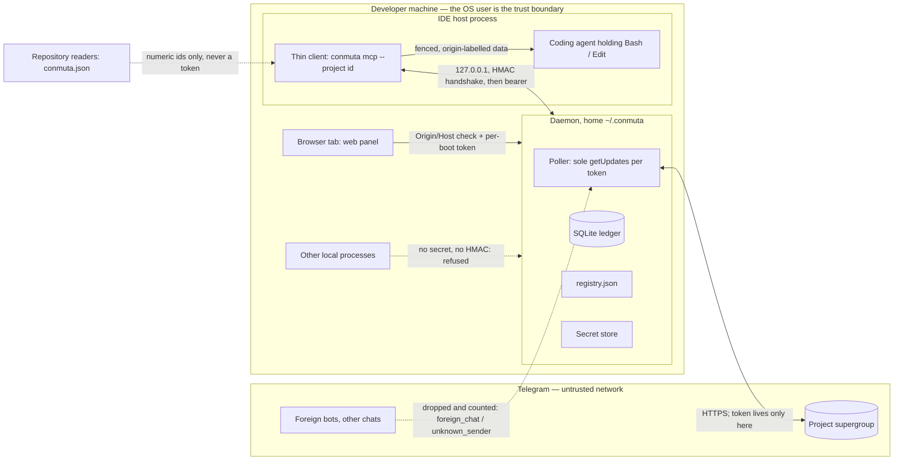

# Threat model — Conmuta core (F0 landing draft)

> **Working name.** "Conmuta" is a working name pending trademark clearance (backlog [B-11](../06-backlog/CHECKLIST.md)). Every identifier that carries it (`conmuta.json`, `~/.conmuta/`, `@conmuta/*`, `conmuta mcp`) follows the final decision.

| | |
|---|---|
| **Status** | F0 landing draft. Threat rows and pinning tests are the input to the F1 SDD spec; test identifiers (`PT-nn`) are proposed names, not files that exist. |
| **Sources** | `research[security-isolation]` in the F0 analysis bundle (rows T01–T15 and its five-invariant recommendation); v1 `test/security.test.ts` (static assertions); v1 `openspec/changes/telegram-agent-bus/design.md` threat matrix (design.md:1264-1290) and ADR-06 layer table (design.md:185-193); debate `bus-v2-landing-architecture-001` (see [../05-tribunal/INDEX.md](../05-tribunal/INDEX.md)). |
| **Citation style** | `v1:<path>:<lines>` is a path inside the frozen telegram-agent-bus checkout at commit `bf8f365` (tag `v1.0.2` + 2 commits; see [../00-INDEX.md](../00-INDEX.md), "Sources of truth outside this tree"). `research:Tnn` is a finding in the analysis bundle. `D1…D11`, `A1…A4`, `n1…n4` are decisions, amendments and objections of the debate. `H1…H7` are the verified facts of the decision record. |
| **Governing rule** | Inherited ADR-12: *a documented guarantee must be pinned by a test that can fail.* Every mitigation below names the test that would fail if it regressed; a mitigation with no test is listed as residual risk, not as a control. |
| **Related** | [CONSTITUTION.md](../01-constitution/CONSTITUTION.md) (invariants verbatim) · [OVERVIEW.md](./OVERVIEW.md) (components, handshake sequence) · [DATA-MODEL.md](./DATA-MODEL.md) (ledger and registry fields) · [ADR-0028](../03-adr/0028-project-scoped-bijective-binding.md) · [ADR-0029](../03-adr/0029-per-user-daemon-and-thin-clients.md) · [ADR-0030](../03-adr/0030-sqlite-ledger-and-json-registry.md) |

## 1. Scope

**In scope — the core product (D3, D6):** the per-OS-user daemon, the thin per-project stdio MCP client, the installer / doctor CLI, the daemon-served local web panel (F3), and the optional Claude Code channels doorbell adapter (F4).

**Out of scope here (own threat models later):** the headless runner satellite `@conmuta/runner` (B-06, post-F6, own constitution), the N-party tribunal (B-10), the desktop tray shell (F8), and the group referee role (B-01, debate `bus-v2-referee-001`).

### 1.1 Trust boundaries

### 1.2 Assets

| Asset | Why it matters | Owner in v2 |
|---|---|---|
| A1 Bot tokens | One token = full control of a bot: read the group, post as the agent, DM peers. One daemon holds N tokens (research:T04). | Daemon secret store (D4) |
| A2 Group membership boundary | Who may talk to the project's agents. Bot-to-bot mode makes the DM inbox reachable by any bot on Telegram (v1 design.md:86). | Binding + per-binding roster (D2, D5) |
| A3 The reading agent's context | Everything surfaced becomes model input in a session that also holds Bash/Edit/git (v1:src/tools/fetch.ts:36-63). | Fence + origin label (I5) |
| A4 Project isolation | A message in the wrong room is disclosure to another organisation — the "cardinal sin" of research:T01/T02. | Bijective binding (I1) |
| A5 Durable inbox and ledger | Lost or duplicated updates break the thread state machine; a rewritten ledger hides an incident. | Daemon, write-ahead inbox (I3), audit log (I5) |
| A6 The developer machine | No exec path may exist between a Telegram message and a shell. | Static assertions (ADR-06 L1–L3) |
| A7 The public repository | Committed files are read by strangers; tenant data or a token in history is permanent. | Governance (D10, B-16) |

### 1.3 Adversaries

| Adversary | Capability assumed |
|---|---|
| X1 Peer bot or agent on Telegram | Any bot with bot-to-bot mode can DM ours; a roster member may be compromised or belong to another company; writes arbitrary bodies. |
| X2 Group admin (human) | Can add members, promote a basic group to a supergroup (migration), grant admin rights to a bot. |
| X3 Repository reader | Reads every committed file, including `conmuta.json` and tool configs, and the whole git history. |
| X4 Another local principal | A process running as a **different** OS user, or a browser tab, on the same machine. |
| X5 Supply chain | A compromised npm dependency or lifecycle script; a planted IDE hook file. |
| X6 Host misconfiguration | The IDE launches the MCP server with a cwd or env that is not the project (parent folder, OpenCode global overlay). |

**Explicitly outside the model.** Malware running as the **same** OS user can read the keychain entry, the identity file and the registry; the OS user boundary is the trust boundary, consistent with the MCP local-server guidance quoted in research:T14. A compromised Telegram, a compromised IDE host binary, and a human who pastes a token into a chat are likewise outside what software here can prevent.

## 2. Invariant map

Short labels used in the register. The verbatim text is law and lives in [CONSTITUTION.md](../01-constitution/CONSTITUTION.md); this document does not restate it.

| Label | Invariant | Primary threats |
|---|---|---|
| **I1** | Bijective binding: one bot ↔ one group ↔ one project; send carries no destination; `chat_id === binding.group_id` asserted before every `sendMessage`; wrong-room CI test. | T01, T08, T15 |
| **I2** | Secrets never leave the daemon: ids-only project files; tokens in the machine secret store; never in IDE env, URLs, logs, errors, stacks; token-shape validator. | T03, T04, T09, T14, T16, T18 |
| **I3** | One poller, durable inbox: sole `getUpdates` consumer per token; update persisted before the offset is confirmed; per-client cursors; a second daemon refuses to poll. | T05 |
| **I4** | Numeric-id identity + scope check on ingest: sender = `message.from.id` in the binding's roster; chat = binding group or private chat from a roster member; everything else counted and dropped; no fail-open anchors. | T02, T07, T08 |
| **I5** | Peer content is data, never action: fenced and origin-labelled; no exec, no fs outside home; nothing applied automatically; rounds and participants capped; per-binding audit log without rejected bodies or tokens. | T06, T10, T13, T17, T19–T22 |
| **GOV** | Not an invariant but a governance control (D9, D10, B-16): packaging, repository hygiene, licence. | T11, T12 |

## 3. Threat register

STRIDE class in brackets: **S**poofing, **T**ampering, **R**epudiation, **I**nformation disclosure, **D**enial of service, **E**levation. Rows T01–T15 keep the numbering of `research[security-isolation]`; T16–T22 are added by this document from the debate record and the v1 threat matrix. Pinning tests are defined in §4.

| id | threat | vector | impact | mitigation | invariant | pinning test |
|---|---|---|---|---|---|---|
| T01 | [T/I] Cross-project leakage on SEND — the "wrong room" | Daemon resolves the wrong (bot, group) for a client: IDE opened at a parent folder or with inherited env/cwd (X6); a BROADCAST fanning out over a roster that mixes two projects (v1:src/tools/send.ts:355-358 fans out to every roster entry). | Project B's traffic posted in project A's group: disclosure to another organisation. | Send has no destination parameter; the binding is fixed at MCP-session start from `--project <id>`, cross-checked against the nearest `conmuta.json`, and the launcher refuses to start when unbound or mismatched (D5); rosters are per binding; the daemon asserts `chat_id === binding.group_id` before every `sendMessage`, else `WRONG_ROOM` + audit row (D2). | I1 | PT-01, PT-02 |
| T02 | [I] Cross-project leakage on RECEIVE | `getUpdates` returns updates from every chat the token can see; v1 only *labels* a foreign chat as `direct` and ingests it if the sender is rostered (v1:src/tools/fetch.ts:436-437, 566); a bot added to a second group, or DM'd by a foreign bot. | Project B's messages enter project A's agent context. | A bot is a member of exactly one group and is never reused (I1); ingest accepts only `chat.id === binding.group_id` or a private chat from a roster member; everything else is counted `foreign_chat` / `unknown_sender`, dropped, never surfaced, never replied to (I4); doctor and a runtime counter flag a bot observed in a foreign chat. | I1, I4 | PT-03, PT-04 |
| T03 | [I] Secret in a committed project file | `conmuta.json` or a tool config (`.mcp.json`, `.cursor/mcp.json`, …) carries a token or bearer. v1 precedent: the token rides `--env` into the IDE config (v1:README.md:108; v1:src/config.ts:239-250). The token shape is public and greppable: `\d+:[A-Za-z0-9_-]{35}` (v1:src/secrets.ts:16). | Anyone with repository read access owns the bot (X3). | `conmuta.json` holds identifiers only (`schema_version`, `project_id`, `group_id`, `roster`, optional `referee`), strict zod, no local paths (D5, n4); MCP entries are `conmuta mcp --project <id>` with no env; a token-shape validator runs in pre-commit and in doctor and rejects token-shaped strings and `Authorization` literals; the installer never writes `enableAllProjectMcpServers: true` (research:T03). | I2 | PT-05, PT-06 |
| T04 | [I/E] Token theft from env, process list, URL, logs or errors | v1 embeds the token in every request URL (v1:src/telegram.ts:361); network and protocol errors attach the raw `cause` (v1:src/telegram.ts:178, 196); startup prints `err.stack` (v1:src/index.ts:279-284); env-passed tokens are inherited by every child process. One daemon holding N tokens multiplies the blast radius. | Full control of one or more bots. | Tokens live only in the OS keychain via `@napi-rs/keyring` or the ACL'd fallback file (D4, B-15); never in IDE env, project files, URLs shown to logs, errors or stacks; the HTTP client wrapper redacts by construction; doctor prints `bot_id` only; BotFather `/token` rotation is a documented runbook. | I2 | PT-07, PT-08, PT-09 |
| T05 | [D/R] Concurrent consumers on one token | A second `getUpdates` consumer gets HTTP 409 (v1:src/telegram.ts:106-118; H1); N IDE sessions on one project share one cursor, so the first fetch consumes the batch for all (v1:src/tools/fetch.ts:500-930, `BRIDGE_BUSY` / `body_omitted` collisions); unfetched updates are dropped after 24 h (H2). | Lost messages; two IDEs on one project collide. | The daemon is the sole poller per token; every update is written to the durable inbox before the offset is confirmed (write-ahead); clients read through per-client cursors; a second daemon instance sees the live lock (`wx` file + pid + heartbeat, stale ≈10 s) and refuses to poll (D3, D4). | I3 | PT-10, PT-11, PT-12 |
| T06 | [T/E] Prompt injection from a peer body into a tool-holding agent | Any rostered peer (X1) writes instructions in a body; the reading agent holds private data + untrusted content + an outbound channel (`send`) — the "lethal trifecta" named in research:T06. | Exfiltration or destructive action executed by the **reading** agent under its own permissions. | Fence `<UNTRUSTED-PEER-INPUT>` with `<` escaped so no peer text can close it (v1:src/tools/fetch.ts:43-63); origin label on every surfaced body; the core never executes or applies anything received; pointer-only payloads (effective ceiling 1,921 chars, D7); secret backstop on send runs before any network call (v1:src/tools/send.ts:333-351). **Stated plainly:** the fence is a labelling control, not a safety guarantee; the last line of defence is the host's native permission prompt (ADR-06 L1). | I5 | PT-13, PT-14, PT-15 |
| T07 | [S] Roster spoofing, mutable usernames, fail-open anchor | A wrong or malicious `user_id` hand-typed into the roster grants a stranger peer status; the DM plane addresses `@username` (v1:src/transport/direct.ts:50), a re-assignable identifier; the wire `to_user_id` wins over the local lookup and a null anchor fails open (v1:src/protocol.ts:98-99, 241-248). | A stranger accepted as a peer; a DM delivered to whoever now holds the username. | Identity is the numeric `message.from.id` reverse-looked-up in the **binding's** roster (v1:src/tools/fetch.ts:404-415, 540-544); `from` is never a tool input (v1:src/tools/send.ts:36-50); usernames are display-only; the roster is the committed `conmuta.json`, reviewed through git; doctor verifies via `getChatMember` that every roster bot is a member of `binding.group_id` and is not an admin; the "pending unknown senders" list (user_id, username, no body) breaks bootstrap circularity without accepting bodies (D5). Fail-open anchor: see §5.7. | I4 | PT-16, PT-17 |
| T08 | [S] Cross-tenant spoofing — a bot of project A reaches project B | In v1 the roster is machine-global (v1:src/config.ts:173-184) and the envelope has no project field (v1:src/envelope.ts:33-60), so a bot known to A could be accepted by B on the same machine. | A's agent accepted as a B peer. | D2 topology: no bot in two bindings (registry invariant "one `bot_id` in at most one active binding"); per-binding rosters; the ingest scope check of I4. The wire field `project_id` proposed by research:T08 is **not** adopted — v2 makes no wire change (D1); the bijective topology makes it unnecessary ("the only mathematically watertight architecture without touching the wire", Alpha). | I1, I4 | PT-04, PT-18 |
| T09 | [I] Windows has no POSIX modes | v1 documents "mode 0600" (v1 design.md:992) but never sets a mode (v1:src/state.ts:445-455 writes with defaults), and `fs.chmod` cannot express owner-only on Windows (research:T09). | Another local user (X4) reads the registry, the IPC identity file or the fallback token file. | Keychain first; the fallback file and the daemon home get an explicit DACL on Windows (`icacls <path> /inheritance:r /grant:r <user>:F`) and `0600` on POSIX (D4); doctor verifies the ACL; explicit `utf8` on every read and write. | I2 | PT-19 |
| T10 | [R] No local audit trail | v1's only ledger is the group; `rejected` / `unapplied` are per batch and not persisted (v1:src/tools/fetch.ts:281-283); errors go to stderr (v1:src/index.ts:289). | A cross-tenant incident cannot be reconstructed; silent drops are invisible. | Append-only per-binding `audit_log` in the SQLite ledger: `ts, project_id, bot_id, chat_id, client_id, direction, eid, type, from_user_id, to_user_id, outcome/reason` (`WRONG_ROOM`, `foreign_chat`, `unknown_sender`, `SECRET_PATTERN_DETECTED`, …); never a body of a rejected or foreign message, never a token (D4, I5). Fields are drafted in [DATA-MODEL.md](./DATA-MODEL.md). | I5 | PT-20 |
| T11 | [T] Supply chain via npm | Lifecycle scripts (`preinstall` / `postinstall`) and planted IDE hook files are active worm vectors; the MCP SDK drags an HTTP stack the stdio client never uses (93 runtime packages in the v1 lock, research:T11). | Code execution on install or on repository open (X5). | Publish compiled `dist` + `npm-shrinkwrap` + `files` whitelist, never `npx` (D9); install with `--ignore-scripts`; exact pins; the repository ships no hook or settings file that executes code on open; the installer never registers the bus globally; provenance / SBOM recommended (pending B-16). | GOV | PT-21 |
| T12 | [I] Tenant data and machine paths in a public repository | v1 carries tenant-specific example ids, a hook with an absolute machine path, session dumps and a Spanish checkpoint literal (research:T12). | Organisation details leak; unsafe defaults for strangers. | New repository with no v1 history (D1); placeholders only; the repo `.gitignore` already excludes `.mcp.json`, `.claude/settings.json` (local stop hook with an absolute machine path), `*.token`, `.conmuta/`, `.env` and `*.txt`; CI secret scan with the bot-token regex and a tenant-identifier deny-list (B-16); a fresh install is inert until a bot and a group are registered. | GOV | PT-22 |
| T13 | [E/D] Debate-layer abuse | Unbounded PROPOSAL / AUDIT / COUNTER rounds; a CONSENSUS or PATCH read as an instruction to apply code. | Resource exhaustion; unreviewed code applied. | Daemon-enforced round cap → `ROUNDS_EXHAUSTED`; participants limited to the binding roster; debates never cross bindings; pointer-only payloads; CONSENSUS is a message, never an action; no PATCH auto-apply (D7). Inherited: `RESOLVED` requires a fail-closed `basis` and `human-approved` requires `approval_ref` (v1 design.md:185-193 L4–L5); `REPLY` forbids `basis` (v1 design.md:431). | I5 | PT-23 |
| T14 | [I] Local IPC reachable by other local processes | Loopback HTTP with a static bearer stored in a project file — the pattern the v1 repository's own `.mcp.json` shows (research:T14); MCP guidance: local servers "may be accessible to other processes". | Another process reads or injects bus traffic or steals the bearer. | IDE-facing surface stays stdio; client ↔ daemon over `127.0.0.1`, random port, per-boot secret in an ACL'd `{port, pid, secret}` file, challenge-response before any bearer (D3; see T16); named pipe / unix socket deferred to spike B-08. | I2 | PT-24 |
| T15 | [T] Binding changes followed automatically | Telegram `migrate_to_chat_id`; roster drift; data received over the bus or from the Bot API proposing a new group. | Posting to a room nobody authorised (X2). | Migration is never followed: v1 `GroupMigratedError` names the new id and refuses (v1:src/telegram.ts:140-160), inherited verbatim; every change to (bot, group, roster, project) is an explicit panel action by the human, audit-logged; the daemon never rewrites a binding from bus or Bot API data; registry hot-reload reads only the file the human edits (D4). | I1 | PT-25 |
| T16 | [S/I] **Ephemeral port reuse after a daemon crash** (Alpha objection n2) | The daemon dies; its identity file survives with the old `{port, pid, secret}`; Windows reassigns the port to a foreign process; a new client reads the stale file and sends its bearer. | The bearer and all of that client's traffic reach a foreign process. | D3 handshake: the client checks PID liveness (`process.kill(pid, 0)`), sends a nonce to `GET /identity`, requires `HMAC-SHA256(secret, nonce)`, and only then uses the bearer; the file is rewritten with a fresh secret on every daemon start and treated as invalid when the PID is dead; respawn goes through the `wx` lock. Analysis in §5.2. | I2 | PT-26 |
| T17 | [E] **Autonomous execution inside the core** (Alpha objection n1) | A headless runner (`claude -p`, `codex exec`, `opencode run`, `gemini -p`) invoked by the daemon on a new `needs_action` feeds peer text into a tool-holding agent with no human in the loop: indirect prompt injection becomes remote code execution. | Arbitrary commands on the developer machine triggered by a Telegram message. | The core is a passive switch under ADR-06 L1–L2: no exec, no shell, no tool invocation, zero autonomous emission, no timers that emit (D6); the runner is the satellite `@conmuta/runner`, post-F6, own constitution, read/reply-only by default (B-06); the heartbeat timer was retracted (A1). Static assertions inherited from v1 (§5.6). | I5 | PT-27, PT-28 |
| T18 | [S/I] Local web panel abuse | A browser tab (CSRF, DNS rebinding) or a local process calls the panel API. | Registry or bindings read or changed by an unauthorised principal. | Bind `127.0.0.1` only, random port, per-boot token, Origin and Host validation (D9). | I2 | PT-29 |
| T19 | [I] Doorbell channel leaks peer prose unfenced | Claude Code channel events reach the model outside the fetch fence. | An injection path that bypasses layer 7 by construction. | Events carry no body and a closed key set (v1 design.md:515; key set pinned in v1 `channel/notify.test.ts`); the adapter is optional and doorbell-only (D6). | I5 | PT-30 |
| T20 | [I] Human group chat entering agent context | With privacy mode disabled the bot reads every group message (research:T10). | Private human conversation surfaced to agents or stored. | Non-envelope text is counted `non_envelope` and never surfaced (v1:src/tools/fetch.ts:525-528); the audit log stores no bodies; docs state that the bot can read the group. | I5 | PT-31 |
| T21 | [D/I] Message destruction, admin escalation | A `deleteMessage` call, or a bot granted admin rights (pin, ban, delete). | The group's record of intent destroyed; admin powers in an agent's hands. | `deleteMessage` is structurally absent (v1:src/telegram.ts:68-71; v1:test/security.test.ts:205-214); doctor flags a bot whose `getChatMember` status is administrator or creator; whether visibility ever requires admin is spike B-07. | I5 | PT-32 |
| T22 | [D] Rate-limit exhaustion and slow exfiltration | A peer or a compromised agent floods the group (≈1 msg/s per chat, 20 msg/min per group, H4), or exfiltrates in many small messages. | Bus unusable; slow leak below the backstop's radar. | 429 mapped to `RATE_LIMITED` with no auto-retry (inherited); debate turns coalesced and sent with `disable_notification` (D7); per-binding outbound rate limit. A bytes-per-hour ceiling is an open question (§7). | I5 (partial) | PT-33 |

## 4. Pinning-test register

Proposed identifiers. The F1 SDD spec assigns real file names; Strict TDD applies (red before green). "Scope" names the bundle or harness the assertion runs against.

| id | assertion that must be able to fail | scope | v1 precedent | phase |
|---|---|---|---|---|
| PT-01 | **Wrong-room CI test.** Two bindings on one daemon with a fake Telegram client that records `chat_id` per call; N sends from client A and N from client B → zero calls with A's `chat_id` carry B's content and vice versa; a forced mismatch yields `WRONG_ROOM` and an audit row. | daemon integration · `test/daemon/transport/room-guard.test.ts` (room-guard unit half: numeric chat_id must strictly equal binding.group_id, string chat_id must be `@<username>` in roster, throws `WrongRoomError` before any call; the full two-binding daemon CI test runs in PR-41) · `test/daemon/send/send-path.test.ts` (send-path unit half: forced mismatch refused before any call, audit row; BROADCAST confined to its binding) | none — new | F1 |
| PT-02 | The `send` input schema has no `chat_id`, `bot`, `group` or `to_chat` key (schema-shape assertion). | client unit · `test/shared/tool-schemas.test.ts`, `test/daemon/send/validate.test.ts` | `from` schema-shape assertion, v1:src/tools/send.ts:36-50 | F1 |
| PT-03 | An update from a non-private chat whose id ≠ `binding.group_id` is counted `foreign_chat`, produces no `needs_action`, no reply, and an audit row without body. | daemon unit · `test/daemon/admission.test.ts` | DM from a non-roster bot dropped, v1 tasks.md:101 | F1 |
| PT-04 | A sender present in binding A's roster but absent from B's is dropped by B as `unknown_sender`. | daemon unit · `test/daemon/admission.test.ts` | v1:src/tools/fetch.ts:540-544 | F1 |
| PT-05 | The validator rejects `conmuta.json` and every installer-written tool config containing a string matching `\d+:[A-Za-z0-9_-]{35}` or an `Authorization` literal; runs in pre-commit and in doctor. | installer unit + hook · `test/shared/token-shape.test.ts` · `test/cli/validate.test.ts` | v1:src/secrets.ts:16; v1:test/secrets.test.ts | F1, F2 |
| PT-06 | `conmuta.json` schema is strict: unknown keys, path-like strings and non-numeric ids are rejected. | shared unit · `test/shared/project-file.test.ts` | none — new (n4) | F1 |
| PT-07 | The thin-client bundle contains no reference to the keychain module, the fallback token path, or `api.telegram.org`; the installer's MCP entry passes no env at all. | static (client bundle) | v1:test/security.test.ts:176-196 pattern | F1 |
| PT-08 | With a fixture token, every error and log path of the Telegram client (network, protocol, API, migration, startup) is asserted not to contain the token literal nor the token regex. | daemon unit · `test/shared/secrets.test.ts` · `test/secret-store/redaction.test.ts` (the shared redactor `redactTokenShapes`, which consumes `TELEGRAM_BOT_TOKEN_RE` from `shared/secrets.ts` and replaces every token match with `<redacted>`) · `test/daemon/telegram.test.ts` (asserts redaction of raw tokens across all error constructors — base, 409 conflict, API error, group migration, network and protocol errors, and undici-like cause URLs; PR-19) | backstop never echoes the match, v1:test/secrets.test.ts:96; v1:test/tools/send.test.ts:647 | F1 |
| PT-09 | Secret-store round trip on win-x64 and darwin-arm64; when the keychain is unavailable the fallback file is created and PT-19 holds. | daemon integration · `test/secret-store/keyring.test.ts` (real Credential Manager round trip on win-x64, no-touch assertion for `registry.json`) · `test/secret-store/index.test.ts` (probe-then-fallback selection: successful probe selects keychain; thrown/silent-write/get-throw probe selects fallback and raises `secret_store_fallback`) | none — new (B-15) | F1, F6 |
| PT-10 | Simulated crash between inbox insert and offset advance → the update is replayed once, never lost; the confirmed offset never exceeds the last persisted `update_id`. | daemon unit · `test/ledger/transaction.test.ts` · `test/ledger/schema.test.ts` (the rollback boundary that leaves a batch with nothing behind, and the `UNIQUE (bot_id, update_id)` dedup a redelivered update hits) · `test/ledger/inbox.test.ts` (the crash-replay scenario itself: a re-served batch is deduplicated and counted `replayed` with nothing written twice; a batch the schema refuses leaves the ledger untouched, the thread rows it had already written included; a batch of drops still moves past every update it covered; one `(bot_id, update_id)` carried twice inside one batch is refused rather than counted as a replay; and the offset advances to `max(update_id) + 1` over every entry the batch covered, never rewinds an offset already ahead of it, and is reported from the ledger rather than from the writer's own arithmetic — PR-12). The offset is therefore one past the highest `update_id` the batch **covered**, and a dropped entry persists no `updates` row, so this row's "never exceeds the last persisted `update_id`" reads as "the offset names no update the ledger skipped" — the reading the evidence above pins, since the offset necessarily sits one past the last persisted row and, in a batch of drops, past every persisted one | at-least-once replay, v1 tasks.md:62 | F1 |
| PT-11 | Two clients on one binding each receive the same batch; advancing one cursor does not move the other. | daemon unit · `test/ledger/cursors.test.ts` (ledger half only: two sessions on one binding initialize at the same `inbox_seq` and see the same rows past it, marking one session's surfaced set and advancing its cursor move nothing for the other, and a fresh session starts at the newest `updates.seq` older than `SESSION_CATCHUP_HOURS` — neither `0` nor the newest — so D-19's catch-up window holds; the half that each of them is *served* that batch by `fetch` is `daemon/serve/fetch`, PR-23, per design §15's PT→file map) | reverses v1 CHANNEL-setup.md:114-120 | F1 |
| PT-12 | A second daemon instance that finds a live lock (pid alive, heartbeat fresh) exits without calling `getUpdates`; a stale lock (dead pid or heartbeat older than the named constant ≈10 s) is reclaimed exactly once. | daemon integration · `test/daemon/lifecycle/lock.test.ts` · `test/daemon/lifecycle/singleton.test.ts` | lockfile → `BRIDGE_BUSY`, v1:src/state.ts:541-576 | F1 |
| PT-13 | `assertFenceIsSound`: the wrapped output opens and closes with the label exactly once and contains no `<` in between, for arbitrary peer input. | shared unit · `test/shared/fence.test.ts` · daemon unit · `test/daemon/serve/thread.test.ts` | v1:test/tools/fetch.test.ts:86-93, 328-357 | F1 |
| PT-14 | Every surfaced body carries `project_id`, `agent_id` and numeric `user_id` taken from the binding and the verified sender, never from the envelope's own claim. | daemon unit · `test/daemon/serve/thread.test.ts` (thread transcript, end to end through admission) · `test/daemon/serve/fetch.test.ts` (fetch `log` half, PR-23) | none — new | F1 |
| PT-15 | Table-driven secret backstop on send: PEM block, `.env`-style assignment, bot-token shape, configured marker → rejected before any network call; the error names the rule, never the match. | daemon unit · `test/shared/secrets.test.ts`, `test/daemon/send/validate.test.ts` | v1:test/secrets.test.ts | F1 |
| PT-16 | A forged envelope `from` that does not match the Telegram `message.from.id` → roster identity is dropped, not surfaced. | daemon unit · `test/shared/protocol-apply.test.ts` · `test/daemon/admission.test.ts` | v1 tasks.md:101 | F1 |
| PT-17 | A thread transition whose addressee anchor cannot be resolved (no wire `to_user_id`, no local roster match) is counted `unanchored` and **rejected**, never authorised. | daemon unit · `test/shared/protocol-apply.test.ts` · `test/daemon/admission.test.ts` | reverses v1:src/protocol.ts:98-99 — see §5.7 | F1 |
| PT-18 | Loading a registry with one `bot_id` in two active bindings fails validation; the daemon activates neither. | daemon unit · `test/registry/invariants.test.ts` | none — new (D2) | F1 |
| PT-19 | On Windows, `icacls` on the fallback file and the daemon home lists only the current user; on POSIX the mode is `0600`; the test runs on both platforms. | installer integration · `test/secret-store/file-fallback.test.ts` (the fallback file written with tmp+rename; on Windows, asserts DACL inheritance from the temp home via real `icacls` output listing only the current user `%USERDOMAIN%\%USERNAME%`; on POSIX, asserts mode `0600`; the daemon never spawns `icacls` — PT-28) | none — v1 claimed but never implemented (research:T09) | F1, F6 |
| PT-20 | Every send, receive and reject appends exactly one audit row; rows for rejected or foreign messages have an empty body column; no row matches the token regex. | daemon unit · `test/ledger/audit.test.ts` (the reject half: a dropped update the poll batch rejected leaves **exactly one** `audit_log` row with `reason = "foreign_chat"` and nothing else behind, and the empty-body half is asserted against the table's own `PRAGMA table_info`, so a column added later cannot pass in silence; the append half: the same writer called twice with the same event leaves two rows and never one rewritten; the *single writer* claim is asserted structurally over **every** `src/ledger/*.ts` — `audit.ts` is the unit's only `INSERT INTO audit_log` and `inbox.ts` imports `./audit.js` — after round 1 found the first version read two files by name and could not fail for a second INSERT in a sibling (`JD-A-006`); and the token half, which drives a fixture token through the **row's own fields** (the harsher case, not merely "present in the originating request") across the audit writer, the poll batch, `unknown_senders`, `conditions.detail` **and `conditions.scope`** — that last one is the column round 1 found the token reaching the file through (`JD-B-001`/`JD-A-002`) — then scans the ledger **file's bytes** after a `wal_checkpoint(TRUNCATE)`, with a raw-SQL control the same scan *does* find, so the clean answer is evidence rather than an empty file) · `test/ledger/unknown-senders.test.ts` and `test/ledger/conditions-store.test.ts` (the two other write paths the "No token in any ledger table" scenario names, each refusing a token-shaped value in its own suite as well). **What this cell deliberately does not claim**: the third write path that scenario names is the *cursor advance*, which lives in `ledger/cursors.ts` — merged in PR-12 and frozen, so **B-37** files the gap rather than this slice editing an audited module; the **peer-body columns** (`updates.body`, and `threads.body`/`thread_history.body` by the same argument) are **unguarded** — the receive-side secret scan this cell first credited them to does not exist anywhere in F1, measured, so **B-38** files it rather than the table being read as covered; and the batch's own `audit_log` writes, their replay behaviour and their offset are **PT-10**'s (`test/ledger/inbox.test.ts`). **B-26 is untouched**: this cell is PT-20, not PT-25 | none — new | F1 |
| PT-21 | `npm pack --dry-run` lists exactly the whitelist; `package.json` has no `preinstall`, `install`, `postinstall` or `prepare` script; `npm-shrinkwrap.json` is present. | CI · `test/security/pack.test.ts` | none — new (D9) | F6 |
| PT-22 | CI scans the repository with the bot-token regex and a deny-list of tenant identifiers; a seeded fixture fails the scan. | CI · `test/security/repo-scan.test.ts` | none — new (B-16) | F0, F6 |
| PT-23 | The (cap+1)-th COUNTER → `ROUNDS_EXHAUSTED`; a participant outside the roster is rejected; an inline patch body (non-pointer) is rejected. | daemon unit | none — new (D7) | F5 |
| PT-24 | An IPC request without a bearer, or with a bearer from a previous boot, is answered `401` and produces no side effect. | daemon unit · `test/daemon/ipc/sessions.test.ts` (the previous-boot-bearer half only: a bearer minted by one `SessionStore` instance does not validate against a fresh instance simulating the next boot, with no observable state change on the failed lookup; the no-bearer-at-all half is `daemon/ipc/routes.ts`'s `401` path, PR-31) | none — new | F1 |
| PT-25 | `migrate_to_chat_id` surfaces `GroupMigratedError` with the new id; the binding is unchanged and no `sendMessage` targets the new id. | daemon unit · `test/registry/loader.test.ts` (registry-side half only) · `test/daemon/send/send-path.test.ts` (the send-path half's pinning test: a group post failing with `GroupMigratedError` reports `delivery.group.new_chat_id`, `config.chat_id` stays unchanged, and no `sendMessage` targets the new id) | v1:src/telegram.ts:140-160 and its test | F1 |
| PT-26 | Handshake: (a) dead PID → identity file treated invalid, no request sent; (b) alive PID but a fake server on the recorded port answering without a valid HMAC → no bearer sent, `DAEMON_DOWN` or respawn; (c) valid HMAC → bearer sent. | client integration · `test/daemon/ipc/handshake.test.ts` (daemon-side half of clause (b) only: pins that the daemon's `GET /identity` proof is deterministic and genuinely bound to its real per-boot secret — a different secret's HMAC never matches — which is the property clause (b)'s client-side "no bearer sent" depends on) · `test/client/handshake.test.ts` (PR-33, client-side half — precisely: clause (a)'s consequent only, a stubbed `ensureDaemonRunning` signalling `DAEMON_DOWN` makes zero `fetch` calls, so no identity request is ever sent; clause (a)'s antecedent, the dead-PID-invalidates-the-run-file property, stays `test/client/run-state.test.ts`'s `readRunFile` coverage from PR-32 and is not re-proven here; clause (b)'s client-side half, an identity response whose proof fails local `timingSafeEqual` verification is retried once against a re-read run file and, failing again, raised as `DAEMON_IDENTITY_MISMATCH` with `POST /session` never called, so no bearer is sent; and clause (c), a verifying identity response proceeds to `POST /session` and returns the daemon's minted bearer — `client/binding.ts` and `test/client/binding.test.ts` pin no clause of this row: the project-binding walk-up is a separate, unrelated guarantee) | none — new (n2, B-08) | F1 |
| PT-27 | **Static assertions, client bundle:** the full v1 set (§5.6) verbatim, plus PT-07 — subject to the ADR-0029 lazy-spawn tension: the F1 spec either scopes the `child_process` assertion so the only permitted spawn target is the daemon entry point (no shell, no user-controlled argv) or moves the spawn into a separate launcher bundle; until then the `child_process` row is a requirement, not a settled assertion. | static (client bundle) · `test/client/spawn.test.ts`, `test/client/run-state.test.ts` (argv/election unit coverage only — the "Argv never carries caller input" scenario; the multi-clause static bundle scan this row's `child_process` clause describes is `test/security/client-bundle.test.ts`, deferred to PR-40 per `tasks.md`'s own PR-32 Requirements-line parenthetical) | v1:test/security.test.ts:176-273 | F1 |
| PT-28 | **Static assertions, daemon bundle:** no `child_process`; `node:fs` only in the allow-listed home-scoped modules; no `.claude/settings` or `permissions.allow`; no `deleteMessage`; `sendMessage` call sites only in transport modules, indented, and reachable only from an IPC request handler; the unbounded loop only in the poller module; the poller module imports no transport module. | static (daemon bundle) | v1:test/security.test.ts:176-273, re-scoped | F1 |
| PT-29 | Panel: a request with a foreign `Origin` or `Host` is rejected; a request without the per-boot token is `401`; the listener is bound to `127.0.0.1`. | daemon unit | none — new (D9) | F3 |
| PT-30 | Doorbell events expose exactly the pinned key set and no body field. | adapter unit | v1 `channel/notify.test.ts` | F4 |
| PT-31 | Mixed batch (human chat, envelopes, malformed, self-echo, duplicate): human text is counted and absent from every output list and from every audit body. | daemon unit · `test/daemon/admission.test.ts` | v1:test/tools/fetch.test.ts mixed batch | F1 |
| PT-32 | Doctor flags a roster bot whose `getChatMember` status is `administrator` or `creator`. | installer unit | non-admin rule, v1:README.md:69-71 | F2 |
| PT-33 | HTTP 429 → `RATE_LIMITED{retry_after_s}` with no auto-retry and an unmoved cursor; consecutive AUDIT+COUNTER turns are coalesced into one group post. | daemon unit · `test/daemon/poller.test.ts` (poller half) · `test/daemon/send/rate.test.ts` (send half) | v1 tasks.md:80 | F1, F5 |

## 5. Focus areas

### 5.1 Wrong-room CI test (I1)

The test exists because the v1 code base cannot leak only by accident of deployment — one machine, one group (research:T01). The moment the daemon serves N bindings, isolation must be proven, not assumed. PT-01 is a mandatory CI job, not a unit test that can be skipped: it boots one daemon with two bindings, drives both clients, and inspects the fake Telegram client's call log. Alpha's condition for approving D2 was exactly this test ("a two-binding wrong-room test runs in CI", invariant 1).

### 5.2 IPC handshake and port reuse (T14, T16)

Sequence and message shapes are in [OVERVIEW.md](./OVERVIEW.md); this section is the adversarial reading.

1. **Stale file, dead PID.** The client reads `{port, pid, secret}`, `process.kill(pid, 0)` fails → the file is invalid; the client attempts a lazy spawn through the `wx` lock; the new daemon overwrites the file with a fresh secret. No request is ever sent to the recorded port.
2. **Stale file, PID reused by an unrelated process.** PID liveness passes (PID reuse is real on Windows), so liveness is a cheap pre-filter, **not** the guard. The client sends a random nonce to `GET /identity` **without** any `Authorization` header. A foreign process on the reused port cannot produce `HMAC-SHA256(secret, nonce)` because it never held the secret. The client refuses, returns `DAEMON_DOWN` or spawns.
3. **Live daemon.** The HMAC verifies; only now does the client send the bearer. The bearer is per boot, so a bearer captured from a crashed daemon's era is useless (PT-24).
4. **Two clients spawn at once.** The `wx` lock arbitrates exactly as v1's `acquireLock` does (v1:src/state.ts:541-576): the loser sees `EEXIST` and retries the handshake against the winner.

What this does **not** defend: a process running as the same OS user, which can read the secret. Named pipe / unix socket with a DACL would not change that either; spike B-08 decides whether they add anything over loopback HTTP on Windows.

### 5.3 Prompt-injection fence and the runner exclusion (T06, T17)

- The fence is inherited unchanged: `<UNTRUSTED-PEER-INPUT>` with `<` → `&lt;`, unforgeable by construction rather than by enumerating tags (v1:src/tools/fetch.ts:43-63). The soundness invariant is PT-13.
- The label is extended with origin: `project_id`, `agent_id`, numeric `user_id` (PT-14). Whether to add an organisation marker for cross-tenant provenance is left to the F1 spec (research:T06 suggests it; the decision record does not).
- The runner exclusion is the structural answer to "the lethal trifecta": the core never places peer text in front of a tool-holding model on its own initiative. The trifecta still exists inside the **human-driven** IDE session; that is the product, and the host's permission prompt is the control. AGENTS.md and the tool descriptions state that fenced content is data (ADR-06 L7).

### 5.4 Token hygiene (T03, T04)

| Stage | Rule |
|---|---|
| Creation | BotFather, one bot per (human, project), guided by the installer (D2). |
| Storage | OS keychain via `@napi-rs/keyring`; fallback ACL'd file under the daemon home (D4, B-15). |
| Use | Only the daemon's Telegram client ever sees the token; the client bundle cannot reference it (PT-07). |
| Exposure | Never in IDE env, project files, URLs shown to logs, errors or stacks (PT-08); doctor prints `bot_id` only. |
| Detection | Token-shape validator in pre-commit and doctor (PT-05); CI secret scan (PT-22). |
| Rotation | BotFather `/token` regenerates; the old token dies; the daemon re-reads the store. Runbook is a SECURITY.md deliverable (B-16). |

### 5.5 Windows ACL and the secret store (T09)

Node's `fs.chmod` on Windows changes only the read-only bit (research:T09), so "0600" is meaningless there. The rule is: keychain first; when the fallback file is needed, the **installer / doctor** applies `icacls <path> /inheritance:r /grant:r <user>:F` to the daemon home once, and files the daemon creates later (identity file, ledger, fallback token file) inherit that DACL. This keeps the daemon bundle free of `child_process` (PT-28) — the daemon never runs `icacls` itself. Doctor re-verifies the ACL on every run (PT-19). To be confirmed by B-08 / B-15.

### 5.6 Inherited static assertions, re-scoped for two bundles (T17)

v1 asserts over the **built** bundle, not the source (v1:test/security.test.ts:7-23). v2 keeps that, with two bundles: the thin client inherits the v1 set verbatim; the daemon legitimately long-polls (D3) and heartbeats its lock, so its set is re-scoped to "no timer or loop can reach a send path".

| v1 predicate (v1:test/security.test.ts) | Client bundle | Daemon bundle |
|---|---|---|
| `hasChildProcessReference` (:44-46, :176-181) | forbidden — subject to the ADR-0029 lazy-spawn tension: the F1 spec either scopes the assertion so the only permitted spawn target is the daemon entry point (no shell, no user-controlled argv) or moves the spawn into a separate launcher bundle; until then this row is a requirement, not a settled assertion | forbidden |
| `hasFsModuleReference` limited to home-scoped files (:48-50, :183-196) | allowed only in the `conmuta.json` walk-up and identity-file readers | allowed only in registry, ledger, secret-store and lock modules under `~/.conmuta` |
| `hasSettingsPathReference` (:52-54, :198-203) | forbidden | forbidden |
| `hasDeleteMessageCallOrDefinition` (:56-59, :205-214) | forbidden | forbidden |
| `hasAutonomousTimerReference` (:61-63, :216-221) | forbidden | allowed only in poller, lock-heartbeat and idle-shutdown modules; none of them may import a transport module |
| `hasUnboundedLoopReference` (:78-80, :232-237) | forbidden | allowed only in the poller module |
| `hasTimersModuleReference` (:90-92, :239-244) | forbidden | same allow-list as timers |
| `sendMessage` confined to transport and indented (:94-101, :246-268) | forbidden entirely (the client never talks to Telegram) | confined to transport modules, reachable only from an IPC request handler |
| non-vacuous scan (:270-273) | kept | kept |

The installer / doctor CLI is a third bundle: it may spawn `icacls` and read tool config files, so it is excluded from the exec assertion but included in the settings-path and `deleteMessage` assertions. Exact module allow-lists are finalised in the F1 SDD spec.

### 5.7 Fail-open anchors without a wire change (T07)

Invariant I4 says "no fail-open anchors"; D1 says no wire change in v2, and AGENTBUS/1 peers may omit `to_user_id`. Both hold because the anchor decision is **receive-side**: v1 already derives a local anchor from the roster when the wire omits one (v1:src/protocol.ts:248) and fails open only when neither source answers (v1:src/protocol.ts:98-99). v2 keeps the derivation and replaces the fail-open branch with a counted `unanchored` rejection (PT-17). A /1 peer whose `to` names an agent in our binding roster still resolves; one that names nobody we know was already `misaddressed` in v1. The F1 spec must confirm this reading against the thread state machine.

## 6. Residual risks — accepted and stated plainly

| Risk | Why it remains | Pointer |
|---|---|---|
| Fence is labelling, not prevention | A capable model can still follow injected instructions; the host permission prompt is the last control. | T06, ADR-06 L7 "Mitigation" |
| Same-user local compromise | Keychain, identity file and registry are readable by the same OS user. | §1.3, §5.2 |
| The bot reads the whole group | Privacy mode must be disabled for bot-to-bot visibility; humans' chat is dropped, but it transits the daemon. | T20, B-07 |
| DM plane addressed by mutable `@username` | Whether bots can be addressed by numeric id is unverified. | T07, research open question 1 |
| `undici` error `cause` may embed the URL | Unverified; redaction by construction (PT-08) covers it regardless. | T04, research open question 2 |
| Windows named-pipe DACL from Node | Unverified; loopback HTTP + HMAC chosen meanwhile. | T14, B-08 |
| macOS controls untested | Keychain and `chmod 600` paths have no macOS evidence yet. | B-12, B-15 |
| No exfiltration-volume ceiling | No data on legitimate traffic volume to set a bytes/hour value. | T22, §7 |
| AGENTBUS/1 peers | Compatibility keeps v1 envelope semantics on the wire until an ADR schedules a coordinated send freeze (D1). | T07, T08 |

## 7. Open questions → backlog

| Question | Backlog / owner |
|---|---|
| Bot-to-bot group visibility for a non-admin bot: AND vs OR semantics; must a project bot ever be admin? | B-07 |
| IPC on Windows 11: is loopback HTTP + HMAC sufficient, or does a named pipe add a real boundary? Can the daemon avoid `child_process` for ACLs through directory inheritance? | B-08, B-15 |
| Which host renders MCP notifications — decides what the doorbell can honestly promise. | B-09 |
| Bytes-per-hour outbound ceiling per binding as an exfiltration brake, and its value. | pending Director decision; no backlog id yet |
| Organisation / cross-tenant marker in the origin label. | F1 SDD spec |
| Can bots be addressed by numeric id in bot-to-bot mode? | research open question 1; spike candidate alongside B-07 |
| SECURITY.md with the five invariants and the token rotation runbook; licence text. | B-16, pending Director |

## 8. Amendments

This document is a design artifact, not law: the invariants it maps to live in [CONSTITUTION.md](../01-constitution/CONSTITUTION.md) and change only through the amendment procedure in [GOVERNANCE.md](../01-constitution/GOVERNANCE.md). Adding or removing a threat row is a normal PR audited by the tribunal; changing a row's invariant mapping or dropping a pinning test requires an ADR.
