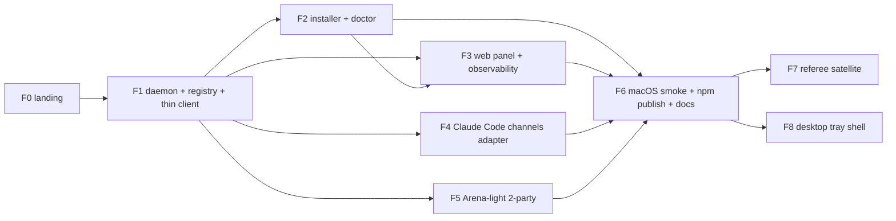

# Work plan — Conmuta, phases F0–F8

> **Conmuta** is a working name pending trademark clearance (backlog B-11).

Agreed in `bus-v2-landing-architecture-001` (D11). Rules that apply to every phase:

| Rule | Source |
|---|---|
| One gentle-ai SDD change per phase, hybrid mode (openspec in repo + Engram). SDD preflight (pace, artifact store, PR strategy) is a **pending Director decision** and precedes F1. | D10 |
| Strict TDD: red before green; every `src` file has a test counterpart; `node:test`. | D9 |
| PRs ≤ 400 lines; Alpha (or Betelgeuse) audits every unit **before** merge; Kairo is the sole writer of the tree; the Director authorizes. | D11, [GOVERNANCE](../01-constitution/GOVERNANCE.md) |
| No wire change in v2; emit `AGENTBUS/2`, accept `/1` and `/2`. | D1 |
| Artifacts in English; conversation with the Director in Spanish. | Language contract |
| Backlog ids `B-xx` refer to [../06-backlog/CHECKLIST.md](../06-backlog/CHECKLIST.md). SDD change names below are **proposed** and are fixed at preflight. | — |

## Dependency graph

## F0 — Landing

| Field | Content |
|---|---|
| Goal | Land the architecture and the law of the repository before any code exists. |
| Deliverables | This docs tree ([../00-INDEX.md](../00-INDEX.md) as single entry); [CONSTITUTION](../01-constitution/CONSTITUTION.md); ADR-0028..0031 ([../03-adr/INDEX.md](../03-adr/INDEX.md)); tribunal record; this plan; name reservation the day the Director decides; spike results written into `docs/`. |
| Dependencies | Debate `bus-v2-landing-architecture-001` (done). Director decisions: name (B-11), license (B-16), SDD preflight, macOS scope. |
| Validation | Every path in the agreed docs tree exists; ADR index lists 0001–0031 with statuses; tribunal index reproduces the debate; each spike has a written result with evidence; no production data from v1 anywhere in the tree. |
| SDD change | none — F0 is produced before SDD preflight; the first SDD change is F1. |
| Spikes | B-05 gentle-ai installer study; B-07 bot-to-bot group visibility AND/OR for non-admin bots; B-08 IPC handshake on Windows 11 + named-pipe reachability; B-09 MCP notification rendering per host. |
| Backlog | B-05, B-07, B-08, B-09, B-11, B-16 (hygiene files land as the decisions arrive). |
| Risks | Name collision forces a rename of `conmuta.json`, `~/.conmuta` and packages — mitigated by keeping the name in one place per document and deciding before F1. Spike B-07 may require project bots to be admins, which conflicts with v1's "bots are never admins" and the pin-checkpoint closed item. |

## F1 — Daemon, registry, thin client, migration

| Field | Content |
|---|---|
| Goal | The passive switch: one daemon per OS user, durable inbox, per-client cursors, thin stdio client bound per project. |
| Deliverables | Daemon (long-poll ≤ 50 s, lock, heartbeat, idle rule); `registry.json` + `node:sqlite` ledger per [ADR-0030](../03-adr/0030-sqlite-ledger-and-json-registry.md); IPC handshake per [ADR-0029](../03-adr/0029-per-user-daemon-and-thin-clients.md); thin client with `--project` + cwd cross-check; `conmuta.json` schema (B-18); secret store + fallback (B-15); unilateral migration from `~/.agentbus` (backup `*.bak`, synthesized registry) (B-13); v1 pure modules imported as a library (D1). |
| Dependencies | F0 spikes B-07 and B-08 (IPC design depends on B-08; admin requirement on B-07). Director: SDD preflight. |
| Validation | All "tests that must pin it" of ADR-0028, 0029, 0030 are green, including the two-binding wrong-room CI test; static security assertions pass over the built bundle; a v1 `~/.agentbus` fixture migrates with a `.bak` and a synthesized registry; `DAEMON_DOWN` path makes zero network calls. |
| SDD change | `f1-daemon-registry-thin-client` (proposed) |
| Spikes | none new; consumes B-07, B-08. |
| Backlog | B-13, B-15, B-18. |
| Risks | The lazy-spawn vs no-`child_process` tension (ADR-0029, Consequences) must be settled in the spec before apply. `@napi-rs/keyring` prebuild gaps (B-15). The ADR-0018 null-anchor reconciliation must not change the wire. |

## F2 — Installer, requirements validator, IDE detection, binding, doctor

| Field | Content |
|---|---|
| Goal | A guided install through the six screens of [OVERVIEW §10.2](../02-architecture/OVERVIEW.md): Installation validator, Control panel, Add bot, Add group, Assign project, Overview table. |
| Deliverables | `@clack/prompts` wizard; Node ≥ 24 gate first (B-17); detection of installed tools and their config paths; id-only stdio entry merged (never overwritten) into each detected tool's project config, opt-in per tool; `AGENTS.md` + `CLAUDE.md` pointer written into the project; `doctor` with offline checks (no token), online checks per binding, opt-in DM probe; global-only tools documented as best-effort; never global in OpenCode. |
| Dependencies | F1. Spike B-05 result (config matrix). |
| Validation | Installer tests of ADR-0031 (no `npx`, gate first, zero writes on failure); merge tests per config format; `doctor` offline mode makes no network call; wrong-room test still green after an install into two projects. |
| SDD change | `f2-installer-and-doctor` (proposed) |
| Spikes | none new; consumes B-05. |
| Backlog | B-17; B-05 closes here. |
| Risks | 12+ config formats drift; per-tool detection on macOS has zero evidence yet (`critic.gaps[6]`); a merge that overwrites a user's existing MCP entry is a data-loss bug and needs its own test per format. |

## F3 — Local web panel, roster sync, version observability

| Field | Content |
|---|---|
| Goal | See the switchboard: bots, groups, projects, bindings, counters, pending unknown senders. |
| Deliverables | Daemon-served panel on `127.0.0.1`, random port, per-boot token, Origin/Host validation; roster sync from `conmuta.json` into the registry; version observability without emission — build/wire version on the render-only header of posts the agent sends anyway (B-14, amendment A1). |
| Dependencies | F1, F2. |
| Validation | Panel refuses requests with a foreign `Origin`/`Host` or a stale token; no token or secret is rendered; a simulated idle window produces zero outbound messages; version appears on a real post's human plane and never on the wire. |
| SDD change | `f3-web-panel-and-observability` (proposed) |
| Spikes | none. |
| Backlog | B-14. |
| Risks | The panel is a second HTTP surface on loopback; it inherits the ADR-0029 handshake concerns and needs the same per-boot secret discipline. |

## F4 — Claude Code channels adapter

| Field | Content |
|---|---|
| Goal | An optional doorbell for Claude Code, fed by the daemon instead of a second reader. |
| Deliverables | Adapter re-based on [ADR-0024](../03-adr/0024-channel-doorbell-not-a-second-reader.md) semantics: no body crosses, peek does not consume, gates on sender not room; one channel per project session. |
| Dependencies | F1. Spike B-09 result (what a host actually renders). |
| Validation | ADR-0024/0025 invariants re-pinned against the daemon inbox: `saturated` rings once per cursor value; watermark commits after delivery; a `<channel>` event never carries peer text. |
| SDD change | `f4-claude-channels-adapter` (proposed) |
| Spikes | consumes B-09. |
| Backlog | — (B-09 informs). |
| Risks | Claude Code channels are a research preview; delivery is best-effort and silently dropped when disabled. Nothing here may be documented as a delivery guarantee. |

## F5 — Arena-light, 2-party

| Field | Content |
|---|---|
| Goal | Two-party debates over the bus without touching the wire. |
| Deliverables | Body-marker subtypes: PROPOSAL = `REQUEST[marker]`; AUDIT/COUNTER = `REPLY[marker + verdict token]`; CONSENSUS = `RESOLVED[existing basis]`; ESCALATE = `RESOLVED[basis abandoned] + marker`; daemon-enforced round cap; pointer-only payloads within the 1,921-char effective ceiling ([ADR-0023](../03-adr/0023-wire-ceiling-reported.md)); side journal in the ledger; `disable_notification` on debate turns; AUDIT+COUNTER coalesced to respect 20 msg/min/group. |
| Dependencies | F1 (journal table, cursors). |
| Validation | Round cap rejects the N+1th COUNTER with a counted reason; a debate never crosses bindings; CONSENSUS is a message — a test asserts no filesystem or process effect from any debate envelope; group rate budget per round is a named constant asserted by behaviour. |
| SDD change | `f5-arena-light-two-party` (proposed) |
| Spikes | none. |
| Backlog | B-10 stays deferred (N-party needs `AGENTBUS/3` or Arena Orion). |
| Risks | Adding a `basis` value would silently break v1 peers; only existing basis values may close a debate (`critic.gaps[3]`). |

## F6 — macOS smoke test, npm publish, final docs

| Field | Content |
|---|---|
| Goal | First public release. |
| Deliverables | macOS smoke test: installer + daemon + LaunchAgent + one IDE (B-12); npm publish of compiled `dist` + shrinkwrap + files whitelist with provenance and 2FA ([ADR-0031](../03-adr/0031-npm-distribution-and-license.md)); LICENSE, SECURITY.md (five invariants), CONTRIBUTING.md, CHANGELOG.md, secret scan in the release checklist (B-16); final docs pass over `docs/00-INDEX.md`. |
| Dependencies | F1–F5; Director decisions on name (B-11), license (B-16) and macOS scope (B-12). |
| Validation | Tarball test and install-without-scripts test green on Windows and (if in scope) macOS; secret scan clean over tree and tarball; a fresh install is inert until a bot and a group are registered (`research[security-isolation]` T12). |
| SDD change | `f6-release-and-docs` (proposed) |
| Spikes | none. |
| Backlog | B-11 (close), B-12, B-16. |
| Risks | macOS claimed without evidence — forbidden by D9; publish under a name that later fails clearance — forbidden by B-11 ordering. |

## F7 — Group referee, skill templates, ticket ledger (satellite)

| Field | Content |
|---|---|
| Goal | The first consumer of the optional runner satellite: a mechanical referee per group. |
| Deliverables | `@conmuta/runner` satellite with its own constitution, read/reply-only by default (B-06); referee role and rule set (B-01); skill templates offered per bot/group (B-02); ticket ledger location decided after B-01 — daemon table exposed as MCP tools vs external adapters (B-03). |
| Dependencies | F6 (published core); dedicated debate `bus-v2-referee-001` ([../05-tribunal/INDEX.md](../05-tribunal/INDEX.md)). |
| Validation | Defined by the referee debate; at minimum the satellite's own static assertions and the invariant that the core bundle stays free of the runner. |
| SDD change | `f7-referee-satellite` (proposed; name may change with the debate) |
| Spikes | none scheduled yet. |
| Backlog | B-01, B-02, B-03, B-06. |
| Risks | The runner is the RCE surface Alpha objected to (n1); it must never ship inside `conmuta`, and its default must remain read/reply-only. |

## F8 — Desktop tray shell

| Field | Content |
|---|---|
| Goal | A system-tray shell wrapping the **same** daemon (sidecar) and the **same** web panel; no second UI. |
| Deliverables | Tauri v2 shell (Alpha's recommendation, amendment A2): official tray and autostart plugins; Windows first, macOS second; signing via Azure Trusted Signing + Apple Developer ID. The tray is optional; the daemon runs headless without it. |
| Dependencies | F6; a signing budget; a Rust toolchain in CI. |
| Validation | The shell launches the published daemon binary as a sidecar and opens the panel URL; no daemon logic is duplicated; uninstalling the shell leaves the daemon functional. |
| SDD change | `f8-desktop-tray-shell` (proposed) |
| Spikes | none scheduled. |
| Backlog | B-04. |
| Risks | Tauri vs Electron is Alpha's recommendation, not yet a Director decision (B-04 `open`); signing costs recur. |

## Backlog cross-reference

| Backlog | Phase | Status in CHECKLIST | Where it is honored |
|---|---|---|---|
| B-01, B-02, B-03 | F7 | open | referee debate `bus-v2-referee-001` |
| B-04 | F8 | open | tray shell |
| B-05 | F0 spike → F2 | open | installer config matrix |
| B-06 | post-F6 (F7) | decided | runner satellite |
| B-07 | F0 spike → F1 | open | admin requirement for project bots |
| B-08 | F0 spike → F1 | open | IPC design |
| B-09 | F0 spike → F4 | open | wake-up honesty per host |
| B-10 | post-F6 | open | N-party tribunal deferred |
| B-11 | F0 → closes in F6 | open | name, before publish |
| B-12 | F6 | open | macOS smoke test |
| B-13 | F1 | open | migration runbook |
| B-14 | F3 | decided | version on the human-plane header |
| B-15 | F1 | open | secret store verification |
| B-16 | F0 → F6 | open | repository hygiene, LICENSE pending Director |
| B-17 | F2 | decided | Node ≥ 24 first gate |
| B-18 | F1 | decided | `conmuta.json` |
